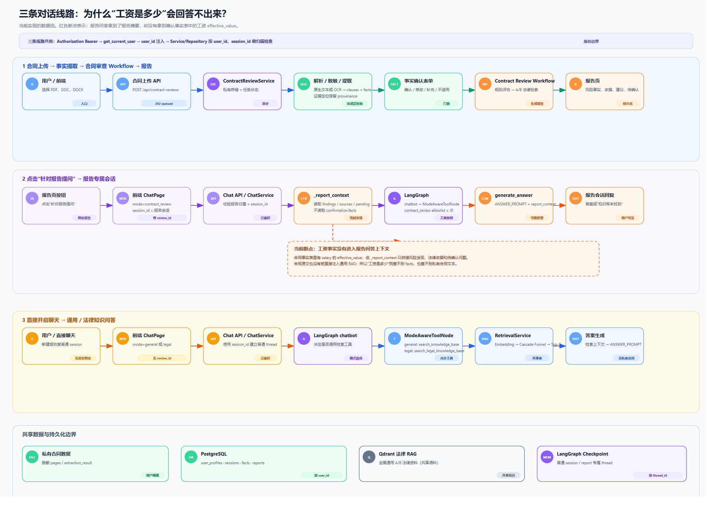
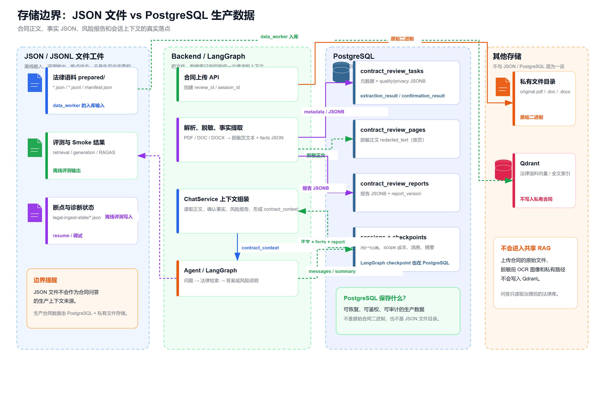
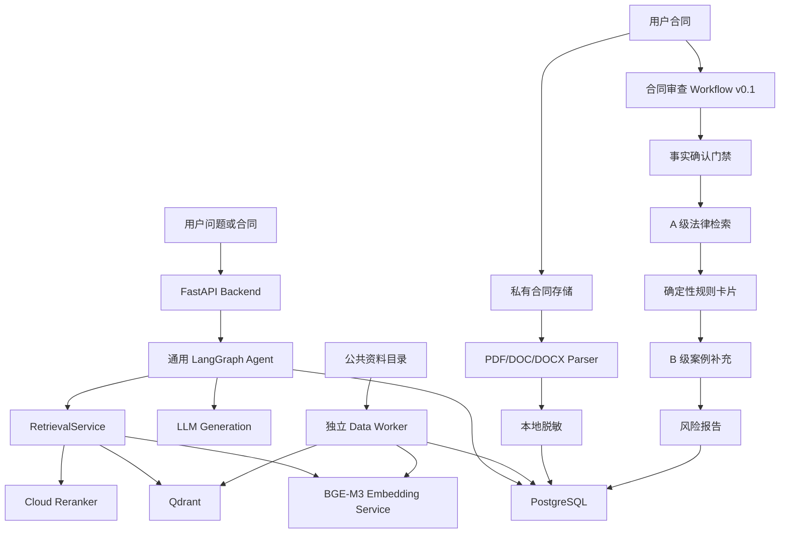

# 劳动合同风险审查助手（Agent + RAG）

这是一个面向中国大陆劳动合同场景的 Agent + RAG 项目。当前仓库已经完成通用 RAG 主链、检索评测闭环、合同文件上传/解析、事实提取/确认，以及可运行的劳动合同审查 Workflow v0.1；A 级法律资料已经完成隔离入库和 10 题法律检索 Smoke Test，法律资料的治理激活和规则卡片专家复核仍在进行中。

> 当前产品定位：给用户提供可追溯的风险事实、法律依据、修改建议和待确认问题，**不替用户决定是否签署，也不构成律师意见或结果保证**。


当前实现的三张总图分别回答三个问题：Workflow 如何审查合同、聊天与合同如何共享会话、JSON/数据库/私有文件/Qdrant 的边界在哪里。

> 图中 PNG 均按 SVG 原始画布尺寸以 2x 分辨率导出，避免 README 预览出现底部裁剪；需要放大查看时，可打开文档目录中同名的 `.svg` 源图。





## 项目状态

| 能力 | 状态 | 说明 |
|---|---|---|
| 通用 Agent + RAG 问答 | 已验证 | FastAPI、LangGraph、BGE-M3、Qdrant、PostgreSQL、Data Worker |
| 三层混合检索 | 已验证 | Dense + BGE-M3 Sparse + BM25，经 L1/L2/L3 漏斗输出 Top-3 |
| 检索基线与 RAGAS | 已完成一轮完整基线 | 30 道 watsonxDocsQA 测试题，结果见下文 |
| 合同上传与解析 | 已实现基础模块 | PDF、DOC、DOCX；私有存储、异步任务、质量状态、脱敏 |
| 条款切分与事实提取 | 首版已接入 | 确定性条款切分、结构化事实 Schema、模型候选事实、本地证据定位；默认关闭外部模型调用 |
| 合同审查 Workflow v0.1 | 已实现骨架 | 事实确认门禁、劳动合同范围检查、A 级法律检索、规则卡片、B 级案例补充和结构化报告；资料库未配置时安全降级 |
| 扫描 PDF OCR | 接口已预留 | 默认关闭，需配置 OCR 服务后启用 |
| 劳动法规则卡片与风险分级 | v0.1 已接入 | 规则节点只输出“可能冲突/待确认/观察”，不替代律师作最终法律结论 |
| A 级法律法条切片与隔离入库 | 技术门禁已通过，治理待激活 | 从官方 Word 派生条级 artifact；保留章节、节、条号、原文、哈希和生效时间；已写入独立 `legal_labor_a_v1`，尚未切换为生产法律库 |
| Web 合同审查前端 | 已接入基础闭环 | 上传、事实确认、报告展示、报告问答和会话恢复已接入；视觉与专家验收继续迭代 |

## 已验证的通用 RAG 能力

### watsonxDocsQA 检索门禁

评测 Collection 为 `watsonx_docsqa_colab_v2`，只用于离线评测，不是生产知识库。当前生产通用语料仍由 `RAG_COLLECTION=rag_chunks` 控制。

| 指标 | v1 当前基线 | v2 原生 Sparse/BM25 |
|---|---:|---:|
| Gold Hit@1 | 83.33% | 83.33% |
| Gold Hit@3 | 90.00% | 90.00% |
| MRR@3 | 86.67% | 86.67% |
| Mean Recall@3 | 90.00% | 90.00% |
| 平均检索延迟 | 6.884 秒 | 1.038 秒 |

在相同问题集、相同最终 Top-3 和相同代码路径下，v2 的召回指标没有退化，平均检索速度约提升 **6.63 倍**。`test_3`、`test_5`、`test_8` 是两个 Collection 共同的未命中样本，`test_8` 被保留为后续英文 lexical 召回优化的回归样本。

### 端到端生成与 RAGAS

| 指标 | v2 完整基线 |
|---|---:|
| 生成完成率 | 30 / 30 |
| Gold Hit@1 / Hit@3 | 83.33% / 90.00% |
| 拒答数量 | 3 |
| 平均总延迟 / P95 | 5.938 秒 / 9.513 秒 |
| RAGAS Answer Correctness | 0.653255 |
| RAGAS Faithfulness | 0.908333 |
| RAGAS Context Relevance | 0.891667 |
| RAGAS 覆盖率 | 100% |

这些结果证明的是通用 RAG 链路的可复现性和输出稳定性，不是法律审查的正确率。法律产品上线前仍需要独立的法律专家复核集和规则级验收。

### A 级劳动法律检索 Smoke Test（staging）

服务器上的 `legal_labor_a_v1` 已完成 10 道固定法律问题的技术验收。每道题不仅检查是否有结果，还检查预期法条、官方来源、施行日期和可引用片段是否同时满足：

| 指标 | 最近一次服务器结果 |
|---|---:|
| 题目数 / 通过数 | 10 / 10 |
| 失败题数 | 0 |
| Gold Hit@1 | 80.00%（8 题首位命中） |
| Gold Hit@3 | 100.00% |
| 总耗时 / 平均耗时 | 24.729 秒 / 约 2.47 秒/题 |
| 来源与引用门禁 | 10/10 均为 `source_level=A`、官方 URL、正确生效日期和可引用片段 |

其中 `labor_legal_03` 和 `labor_legal_08` 的预期法条排在第 2 位，但仍在 Top-3 内，属于通过而不是漏召回。该次运行显式使用了 `--allow-pending-governance`，因此结论是“staging 技术检索通过”，不是“法律资料已获准生产使用”。在法律专业复核完成、manifest 状态变为 `ACTIVE` 后，必须去掉该参数再跑一次正式门禁；在此之前不要把 `LEGAL_A_COLLECTION` 切入生产配置。

复现命令和治理边界见 [`docs/contract-server-acceptance.md`](docs/contract-server-acceptance.md) 的“ A 级劳动合同法律检索门禁”一节。Smoke 输出只保存检索元数据和截断后的引用片段，不保存合同原文。

## 合同上传与解析模块

合同上传模块位于 `backend/app/api/contract_reviews.py`、`backend/app/services/contract_review_service.py` 和 `backend/app/infrastructure/` 下。当前模块只负责“安全接收合同并生成脱敏文本”，还不会给出法律风险结论。

### 当前支持

- **PDF**：使用 PyMuPDF 逐页检查文本层；扫描页或文本覆盖率不足时标记为 `needs_confirmation`，可在配置 OCR 后处理。
- **DOCX**：读取 OOXML 正文和表格，兼容 Transitional 与 Strict 两种命名空间；仍可能产生 `format_page_boundary_unavailable`。
- **DOC**：通过 `antiword` 提取旧式 Word 文本；Docker 镜像会安装该运行时。若本机没有可用的 `antiword`，应先转换为 PDF 或 DOCX。
- **隐私处理**：进入后续 LLM、Embedding、Reranker 和日志前，脱敏身份证号、手机号、银行卡号，并清理零宽字符等不可见字符。
- **任务状态**：`queued → extracting → ready / needs_confirmation / failed`。任务和结果写入 PostgreSQL，原始文件保存在私有目录，不进入公共 Qdrant 语料库。
- **质量门禁**：记录页数、文本覆盖率、OCR 使用情况、失败页、可疑页和脱敏统计；不把“解析完成”误认为“合同格式完全还原”。
- **条款与事实提取**：解析完成后可按 `CONTRACT_EXTRACTION_ENABLED=true` 启用。条款先由确定性切分器生成，再由模型提取候选事实；短合同在字符数阈值内只调用一次模型，长合同按条款批次调用，避免把整份长合同塞进单个上下文。每条事实必须在脱敏页文本中重新定位证据，缺证据、低置信度或相互矛盾的字段会进入 `needs_confirmation`。
- **边界**：事实提取不输出“违法/高风险/建议签署”等法律结论；`extraction_status` 与文件解析 `status` 独立保存，模型失败不会把已经成功解析的合同标记为文件解析失败。


### 条款与事实提取模块

解析通过质量门禁后，系统先用确定性规则切分条款，再按 `contract_extraction` Schema 提取候选事实。每条事实都必须在脱敏页文本中定位证据；缺少证据、置信度不足或同名事实冲突时，进入确认问题，而不是直接生成法律结论。

事实提取的调用策略和 JSON 门禁如下：

- `total_clause_chars <= CONTRACT_EXTRACTION_SINGLE_PASS_MAX_CHARS` 时使用 `extraction_mode=single`，整份脱敏条款只调用一次 LLM；超过阈值时使用 `extraction_mode=batch`，按 `CONTRACT_EXTRACTION_BATCH_CLAUSES` 条款一批调用。
- System Prompt 明确要求外层 `{"schema_version": 1, "facts": [...]}`，每条事实必须包含 `field_key`、`category`、`name`、`value`、`status`、`confidence`、`clause_ids`、`evidence_quotes`、`needs_confirmation`、`note` 十个字段。
- `status` 只能是 `confirmed`、`ambiguous`、`missing`、`contradicted` 或 `needs_confirmation`；合同没有写明的字段必须返回 `value=null`、`status=missing`、`needs_confirmation=true`，不能静默省略。
- 外层 Schema 和单条事实都使用额外字段禁止策略；格式不完整的单条事实会被计数并跳过，其余事实继续处理。服务随后对劳动合同首版必备字段做本地覆盖检查，缺失字段补成带确认问题的 `missing` 事实。
- 结果增加 `extraction_mode`、`model_calls`、`invalid_fact_count` 和 `missing_required_fields`，便于观察一次提取究竟调用了几次模型以及哪些字段需要用户补充。

默认参数为 `CONTRACT_EXTRACTION_SINGLE_PASS_MAX_CHARS=12000`、`CONTRACT_EXTRACTION_MAX_CHARS=12000`、`CONTRACT_EXTRACTION_BATCH_CLAUSES=6`。短合同阈值应结合模型上下文窗口和实际脱敏文本长度调整，不建议盲目增大。


### 事实确认模块（已实现基础版）

事实提取完成后不会直接进入法律规则判断。确认模块会把每条事实的原始提取值、脱敏合同证据和待确认问题组成表单，用户可以执行五类动作：确认、修改、补充、标记不适用、暂不确认。

- 原始提取值（`original_value`）和原始证据始终保留，不被用户输入覆盖。
- “修改”必须在脱敏合同中重新定位到证据；找不到证据时拒绝伪造合同事实，并提示改用“补充”。
- “补充”单独保存 `user_value`，有效来源标记为 `user`，不能伪装成合同原文。
- 每次提交携带 `base_revision` 和可选 `request_id`，通过 PostgreSQL 乐观锁和追加式事件表防止并发覆盖并支持重试幂等。
- 只有必答事实全部解决并显式提交后，`ready_for_legal_review` 才会为 `true`；确认层不输出违法或是否签署结论。


### 当前限制

扫描 PDF 的 OCR 需要单独配置外部 OCR 服务；DOC/DOCX 无法稳定恢复 Word 原始分页、页眉页脚和浮动文本框，因此相关任务可能进入 `needs_confirmation`。用户合同不会写入 `rag_chunks` 或任何公共评测 Collection。

## 合同审查 Workflow v0.1

首版只做全国通用的中国大陆劳动合同规则，不做地方性判断。产品流程按固定节点编排，先作为 Workflow 实现，再考虑是否开放更自由的 Agent 行为：

```text
上传与隐私确认
  → 文件解析与质量检查
  → 本地脱敏与合同条款结构化
  → 合同范围/事实确认
  → 信息不足时向用户追问
  → A 级法律条文检索
  → 确定性规则计算风险等级
  → B 级官方案例补充解释
  → 证据链校验
  → 输出风险事实、等级、依据、修改建议和待确认事项
```

风险等级由确定性规则和证据状态共同决定；LLM 负责提取、检索、解释和报告表达，不直接替代规则引擎做最终判定。事实不充分时，系统应降低结论置信度并继续追问，而不是编造答案。

当前入口为 `POST /api/contract-reviews/{review_id}/workflow`。它必须先通过事实确认接口的 `ready_for_legal_review=true` 门禁；未确认时只返回待补充问题。A 级法律资料和 B 级案例分别使用 `LEGAL_A_COLLECTION`、`LEGAL_B_COLLECTION`，不会读取 `rag_chunks` 或 `watsonx_docsqa_colab_v2`。两个环境变量默认为空，法律库只有在显式配置后才会接入；`LEGAL_A_ALLOW_PENDING_GOVERNANCE=true` 仅允许 staging 读取尚未完成法律复核的资料。资料库未配置或检索失败时报告标记为 `partial`，不会把“没有检索结果”解释成“没有风险”。


## 技术架构



### 主要目录

```text
.
├── backend/                 # FastAPI、LangGraph、检索和合同上传后端
│   ├── app/
│   │   ├── api/             # chat、session、eval、contract-reviews
│   │   ├── agent/           # 通用 Agent 与合同审查 Workflow 图
│   │   ├── infrastructure/  # Qdrant、PostgreSQL、Parser、OCR、私有存储
│   │   ├── schemas/         # API、检索、合同和事实提取数据契约
│   │   └── services/        # 认证、会话、检索、合同解析、提取、确认和规则审查
│   ├── sql/                 # 初始化表和迁移
│   └── tests/               # 后端单元测试
├── data_worker/             # 公共资料增量解析、向量化、写入
├── evaluation/              # 固定问题集、基线、追踪、人工抽查、RAGAS
├── frontend/                # 当前 React/Nginx 前端（合同产品待改造）
├── cli/                     # 本地辅助 CLI
├── docs/                    # 架构、API、迁移、评测和流程图
├── docker-compose.yaml      # 主服务编排
├── docker-compose.dev.yaml  # 后端开发覆盖配置
├── PLAN.md                  # 当前阶段计划和验收门禁
└── AGENTS.md                # 协作与安全边界
```

`data/`、模型文件、数据库持久化目录、`.env`、CodeGraph 索引和真实合同样本均属于本地边界，不提交到 Git。

## 启动与测试

### 启动主服务

```bash
docker-compose -f docker-compose.yaml -f docker-compose.dev.yaml up -d
curl http://127.0.0.1:8000/health
```

修改普通后端源码时优先重启，不要重建 Embedding 镜像：

```bash
docker-compose -f docker-compose.yaml -f docker-compose.dev.yaml restart backend
```

只有修改依赖或 Dockerfile 时才重建 Backend。`embedding_service` 的模型和 Transformers 依赖变化才需要单独重建该服务。

### 启动 Data Worker

```bash
docker-compose -f data_worker/docker-compose.yml up -d --build
```

Backend 和 Data Worker 必须使用同一个生产 `RAG_COLLECTION`。评测 Collection（如 `watsonx_docsqa_colab_v2`）只在评测命令中显式传入，不用于生产写入。

### 准备劳动法律 A 级语料

法律原文不是通用 RAG 的固定长度 Chunk。先在本地从已核验的 Word/Markdown 生成条级 artifact；每条记录保留章节、节、条号、原文偏移、原始文件 SHA-256、官方 URL 与生效日期：

```bash
uv run python -m data_worker.legal_cli prepare \
  --base data/legal/labor_contract \
  --overwrite

uv run python -m data_worker.legal_cli validate \
  --base data/legal/labor_contract
```

输出位于 Git 忽略的 `data/legal/labor_contract/prepared/a_level/`，包含 `articles.jsonl`、`article_chunks.jsonl`、`manifest.json` 与 `validation.json`。当前 artifact 可以上传到服务器并进行隔离 Collection 的导入测试，但 `legal_activation_status=PENDING_LEGAL_REVIEW` 时不能切换 `LEGAL_A_COLLECTION`，也不能作为正式高风险结论的唯一法律依据。

服务器只需重建 **Data Worker** 镜像；不需要重建 Backend 或 Embedding Service。上传 `data/legal/` 后，先执行 dry-run：

```bash
cd data_worker
docker-compose up -d --build
docker exec sentinel python -m data_worker.legal_cli ingest \
  --base /app/data/legal/labor_contract \
  --allow-pending-governance \
  --dry-run
```

实际导入会新建或续传 `legal_labor_a_v1`，并明确拒绝写入 `rag_chunks` 与 watsonxDocsQA Collection。完成法律复核和检索门禁前，不能修改 Backend 的 `LEGAL_A_COLLECTION`。

服务器入库完成后，先用独立 Smoke Test 验证 A 级法条过滤、引用资格、条号和官方链接。当前资料仍处于 staging，因此必须显式加 `--allow-pending-governance`：

```bash
docker exec backend python /app/evaluation/legal_retrieval_smoke.py \
  --collection legal_labor_a_v1 \
  --qdrant-url http://db_qdrant:6333 \
  --embed-url http://embedding_service:8001/embed \
  --allow-pending-governance \
  --output /app/data/legal/legal_retrieval_smoke_v1.json
```

Smoke Test 只查询独立法律 Collection，不会修改 Qdrant；通过后再用一份已确认事实的劳动合同运行 Workflow。

### 运行测试

```bash
uv run pytest backend/tests evaluation -q
uv run ruff check backend evaluation data_worker
```

### 劳动合同上传 Smoke Test

`evaluation/contract_review_smoke.py` 会上传一份真实劳动合同，轮询异步解析和事实提取，
只输出任务状态、质量/脱敏统计、`extraction_mode`、模型调用次数和必备字段缺失列表，
不会打印合同页文本或模型原始返回。

```bash
uv run \
  --with-requirements backend/requirements.txt \
  python evaluation/contract_review_smoke.py \
  --file test_contract/劳动合同.doc \
  --base-url http://127.0.0.1:8000 \
  --token "$TOKEN" \
  --expect-mode single \
  --output data/contract_review_smoke.json
```

短合同预期为 `extraction_mode=single`、`model_calls=1`；超过
`CONTRACT_EXTRACTION_SINGLE_PASS_MAX_CHARS` 后预期为 `batch`。`needs_confirmation` 是正常的
人工确认状态，不代表上传或提取失败；只有 `failed` 或超时才算 Smoke Test 失败。

### 服务端迁移与三格式上传门禁

服务器端需要先按顺序执行 `005/006/007` 数据库迁移，再运行只读 schema 检查和 PDF/DOC/DOCX
真实 API 回归。新工具不会输出合同正文或敏感哨兵值，并默认在验证后删除 Smoke 任务：

```bash
docker exec backend python /app/evaluation/contract_migration_check.py \
  --host db_pg --port 5432 --user admin --database ai_assistant \
  --output /app/data/contract_migration_check.json

uv run --with httpx python evaluation/contract_upload_api_smoke.py \
  --file pdf=/root/my-ai-research/test_contract/劳动合同.pdf \
  --file doc=/root/my-ai-research/test_contract/劳动合同.doc \
  --file docx=/root/my-ai-research/test_contract/劳动合同.docx \
  --base-url http://127.0.0.1:8000 --token "$TOKEN" \
  --require-extraction --allow-external-ocr \
  --output data/contract_upload_api_smoke.json
```

完整前置检查、隐私哨兵和失败诊断见 [`docs/contract-server-acceptance.md`](docs/contract-server-acceptance.md)。

先用 `evaluation/rag_smoke.py` 验证主链返回 `answer`、`contexts` 和 `documents`，再运行固定问题集和 RAGAS。RAGAS 依赖留在 `evaluation/requirements.txt`，不装进 Backend 镜像。

### 合同审查 Workflow 法律引用回归

在 A 级法律检索 Smoke Test 通过后，可用脱敏/自拟劳动合同运行完整法律引用回归：

```bash
uv run --with httpx --with pypdf python evaluation/contract_review_e2e.py \
  --file /root/my-ai-research/test_contract/劳动合同.docx \
  --base-url http://127.0.0.1:8000 --token "$TOKEN" \
  --resolution-policy supplement \
  --ack-test-confirmation-writes \
  --require-legal-citations \
  --allow-pending-legal-governance \
  --output data/contract_legal_workflow_e2e.json
```

`--require-legal-citations` 会验证报告是否返回 A 级法律来源、国家法律文库官方 URL、
生效日期、法条编号、可引用片段和治理状态。`--allow-pending-legal-governance` 仅适用于
当前 `PENDING_LEGAL_REVIEW` 的 staging；法律资料改为 `ACTIVE` 后，正式回归必须去掉该参数。
详细门禁和失败诊断见 [`docs/contract-server-acceptance.md`](docs/contract-server-acceptance.md)。

## 文档导航

- [当前计划与验收门禁](PLAN.md)
- [文档索引](docs/README.md)
- [合同上传 API](docs/api/backend.md)
- [合同上传模块流程](docs/contract-upload-module.png)
- [条款与事实提取模块流程](docs/contract-extraction-module.png)
- [事实提取详细流程](docs/contract-fact-extraction-flow.png)
- [事实确认模块流程](docs/contract-fact-confirmation-flow.png)
- [合同审查 Workflow v0.1](docs/contract-review-workflow.png)
- [整体开发状态流程图](docs/contract-review-workflow-status.png)
- [统一会话数据流图](docs/chat-route-data-flow.png)
- [JSON、PostgreSQL、私有文件与 Qdrant 存储边界图](docs/storage-boundary.png)
- [存储边界文字说明](docs/storage-boundary.md)
- [劳动合同法律语料计划](docs/labor-contract-legal-corpus-plan.md)
- [合同服务端迁移与上传验收 Runbook](docs/contract-server-acceptance.md)
- [自研三层检索算法](docs/self-developed-retrieval-algorithm.md)
- [Qdrant v2 迁移记录](docs/retrieval-v2-migration.md)
- [watsonxDocsQA 完整基线](docs/watsonx-docsqa-full-baseline.md)

## 安全与法律边界

请勿把真实合同、身份证号、手机号、银行卡号、API Key、Cookie 或 `.env` 提交到公开仓库。合同原文只在私有存储中处理，公共 Qdrant 仅用于公共法律/案例资料。任何法律风险结论都应以证据、规则版本和人工复核为前提；本项目当前只提供参考性信息，不承担法律责任或签署决策责任。

## 当前开发闭环：统一会话、报告与发布治理

当前产品主线已经从“上传后单独提取”扩展为同一 `session_id` 下的连续工作流：用户可以先问全国通用劳动法问题，再上传合同；也可以先上传合同、确认事实、生成报告后，继续在同一个会话中针对报告提问。合同原文不会进入普通聊天上下文，报告问答从 PostgreSQL 读取脱敏正文、事实和报告并装配 `contract_context`，而不是依赖一个额外的 JSON 文件。

### 已完成的后端能力

- 合同上传时绑定会话，并支持 `short`（默认 7 天）和 `long_opt_in`（默认 30 天）留存策略；
- 报告按版本持久化到 PostgreSQL，可通过 JSON 查询或下载为 PDF；
- 报告问答使用 `mode=contract_review` 与 `review_id`，服务端校验会话和用户归属；
- 合同删除会同时删除数据库记录和私有文件；服务启动时清理到期记录；
- 留存清理任务会持续运行（默认每 300 秒），不会只依赖重启触发；
- 统一会话历史接口需要认证，避免跨用户读取；
- 本地法律评测题生成、安全冒烟和发布门禁脚本已经加入 `evaluation/`。

### 当前数据边界

- **JSON/JSONL**：法律条文 prepared artifact、评测输入/输出、Smoke Test 结果和入库状态等离线工件；它们不是在线会话的主存储。
- **PostgreSQL**：用户、会话、合同任务、脱敏页、结构化事实、确认事件、报告版本和 LangGraph checkpoint；报告问答每次从这里装配 `contract_context`。
- **私有文件存储**：用户上传的原始 PDF/DOC/DOCX，仅按用户和审查任务隔离访问，不进入日志或共享 Qdrant。
- **Qdrant**：只保存经过治理的共享法律/案例检索语料；通用评测 Collection 与生产法律 Collection 保持隔离。

### 迁移与验证

旧数据库按顺序执行：

```bash
docker exec -i db_pg psql -U admin -d ai_assistant < backend/sql/migrations/005-session-contract-report.sql
docker exec -i db_pg psql -U admin -d ai_assistant < backend/sql/migrations/006-contract-retention.sql
docker exec -i db_pg psql -U admin -d ai_assistant < backend/sql/migrations/007-session-conversation-scope.sql
```

运行后端测试、前端构建和治理检查：

```bash
uv run --with-requirements backend/requirements.txt --with pytest python -m pytest backend/tests -q
npm --prefix frontend run lint
npm --prefix frontend run build
uv run --with-requirements evaluation/requirements.txt --with-requirements backend/requirements.txt --with pytest python -m pytest evaluation/test_contract_release_gate.py -q
```

评测门禁要求法律 Smoke Test、安全 Smoke Test 和专家评测集全部通过；专家题目生成器只读取本地 A 级法条，初始结果标记为 `DRAFT_NEEDS_EXPERT_REVIEW`，未经法律人士复核不得作为发布依据。

生产环境必须在 `.env` 中设置至少 32 个字符的随机 `AUTH_SECRET_KEY`；缺失或过短时 Backend 会拒绝启动。例如：

```bash
printf 'AUTH_SECRET_KEY=%s\n' "$(openssl rand -hex 32)" >> .env
```

可通过 `CONTRACT_RETENTION_CLEANUP_INTERVAL_SECONDS` 调整留存清理周期。

### 尚未完成的产品任务

邀请制访客 token、删除审计事件、组织级权限/RLS、A/B 法律资料正式激活和 B 级指导案例专家复核仍是后续开发项。它们不能在当前版本中被当作已上线能力。
