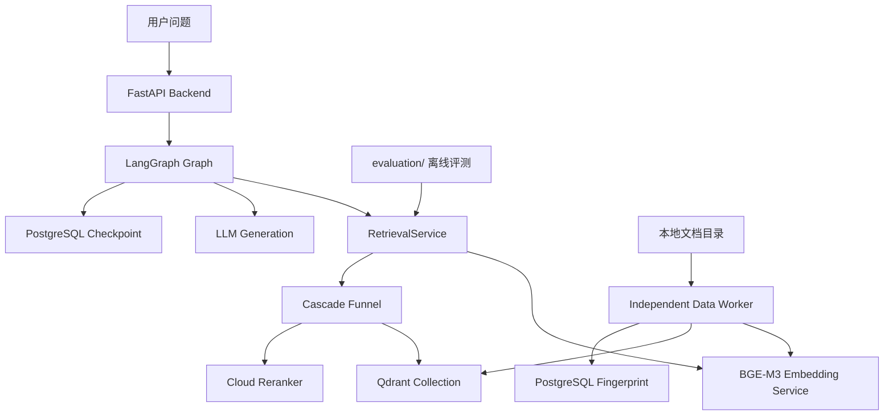
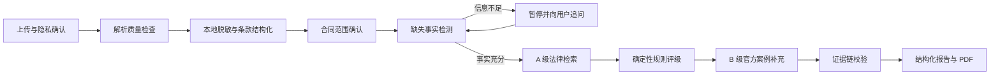

# AI Knowledge Base Assistant

一个已完成检索与评测基础设施验证、正在向“**中国大陆劳动合同风险审查助手**”演进的 Agent + RAG 项目。

当前仓库包含两条明确分开的线：

- **已验证的通用 RAG 基础设施**：FastAPI、LangGraph、BGE-M3、Qdrant、PostgreSQL、独立 Data Worker，以及可复现的检索/生成/RAGAS 评测链路；
- **待实现的劳动合同产品**：面向个人的邀请制内测 Workflow。它会在受控范围内审查签署前的劳动合同，并输出可追溯的风险事实、法律依据、修改建议与待确认问题。

> 重要：目前上线可用的是通用知识库问答链路；劳动合同审查 Workflow、法律规则库、用户合同隔离和产品前端仍处于设计与实施起步阶段。仓库不会把尚未实现的法律能力描述为已可用功能。

## 项目定位

### 当前通用 RAG 能做什么

- 对接外部 LLM，基于检索到的 Top-3 上下文生成带引用的回答；
- 通过 Dense、Sparse 与 BM25 三路召回，提高语义匹配和关键词匹配的互补性；
- 用独立 Data Worker 监听文档、切块、生成向量并以 SHA-256 指纹实现增量入库；
- 用固定问题集、人工抽查和 RAGAS 分阶段评估检索与回答质量；
- 通过 `RAG_COLLECTION` 配置切换 Qdrant Collection，支持离线建库、验证、切换与回滚。

### 正在建设的劳动合同产品

首版是“劳动合同风险审查助手”，不是自动审批系统，也不替用户决定是否签署合同。

| 项目 | 首版范围 |
|---|---|
| 主要用户 | 签署劳动合同前的个人用户；企业场景只预留后续扩展空间 |
| 地域与时间 | 中国大陆、全国通用规则、签署前审查；报告锁定评估日期 |
| 输入 | 文本可读的 PDF、DOCX、粘贴文本；扫描件、照片和手写件暂不支持 |
| 法律依据 | A 级：现行有效法律、行政法规、司法解释和官方规范性文件；B 级：最高法指导/典型案例等官方案例 |
| 排除内容 | 地方性判断、诉讼/仲裁代理、自动决定签或不签、律师公众号和其他 C 级行业文章 |
| 输出 | 风险严重程度、判断可信度、状态、合同原文位置、法条依据、可选案例、解释、修改建议、协商参考和待确认事实 |

完整产品规格见公开 GitHub Issue：[中国大陆劳动合同风险审查 Workflow（邀请制内测）](https://github.com/ccxx777/-agent/issues/1)。

## 当前状态与已验证结果

### 检索性能：watsonxDocsQA 公平对照

使用 1,144 篇 IBM watsonx 文档、30 道测试题，在**相同当前代码、同一问题集和相同最终 Top-3**条件下对比旧 Collection 与原生 Sparse/BM25 Collection：

| 指标 | v1：`watsonx_docsqa_colab_v1` | v2：`watsonx_docsqa_colab_v2` |
|---|---:|---:|
| Hit@1 | 83.33% | 83.33% |
| Hit@3 | 90.00% | 90.00% |
| MRR@3 | 86.67% | 86.67% |
| Mean Recall@3 | 90.00% | 90.00% |
| 平均检索延迟 | 6.884 秒 | 1.038 秒 |

v2 在检索指标不退化的前提下，平均检索速度提升 **6.63×**。`test_3`、`test_5`、`test_8` 是两套 Collection 共同的 Gold 未命中题；其中 `test_8` 被保留为英文 lexical 召回的回归样本，并非 v2 迁移造成的退化。

### 端到端生成与 RAGAS：v2 基线

以下数据来自 `watsonx_docsqa_colab_v2`、`deepseek-v4-flash`、30 道测试题的完整运行：

| 指标 | 结果 |
|---|---:|
| 生成完成率 | 30 / 30 |
| Gold Hit@1 / Hit@3 | 83.33% / 90.00% |
| 拒答数量 | 3 |
| 平均总延迟 / P95 | 5.938 秒 / 9.513 秒 |
| RAGAS Answer Correctness | 0.653255 |
| RAGAS Faithfulness | 0.908333 |
| RAGAS Context Relevance | 0.891667 |
| RAGAS 指标覆盖率 | 100% |

这些结果证明通用 RAG 主链具备稳定的结构化输出和可用的评测闭环；**它们不是法律产品正确率，也不能替代法律专业复核**。完整运行签名、人工抽查和评分说明见 [watsonxDocsQA 完整基线](docs/watsonx-docsqa-full-baseline.md)。

### Collection 边界

- 生产通用知识库当前仍为 `rag_chunks`；
- `watsonx_docsqa_colab_v1` 与 `watsonx_docsqa_colab_v2` 都是隔离的评测 Collection；
- 它们绝不能被当作生产知识库，也不能作为未来法律语料库；
- 用户合同永远不写入公共法律 Qdrant Collection，也不默认用于训练或评测。

## 系统架构



### 运行时服务

| 服务 | 责任 |
|---|---|
| `frontend` | React 构建产物由 Nginx 提供服务，并反向代理 API；当前旧前端被冻结，后续会替换为任务式合同审查界面 |
| `backend` | FastAPI API、LangGraph 编排、会话与稳定的检索/生成边界 |
| `embedding_service` | BGE-M3 HTTP 服务，一次返回 1024 维 Dense 与 Sparse 向量；单进程加载模型并限制并发 |
| `db_pg` | PostgreSQL + pgvector：用户/会话、LangGraph Checkpoint、文档指纹等持久化状态 |
| `db_qdrant` | Qdrant：生产通用知识库及隔离评测 Collection |
| `sentinel` | 独立 `data_worker` 容器，负责公共语料的增量读取与写入 |

Redis、Component Registry、YAML Pipeline 和 Backend 内旧 Sentinel 已退出当前生产结构，不再参与主链。

## 通用 RAG 主链

```text
用户问题
  → LangGraph 工具节点
  → RetrievalService（唯一业务入口）
  → BGE-M3 Query Dense + Sparse Embedding
  → 查询语言识别与 Query Specificity
  → L1：Dense + BGE-M3 Sparse + BM25 并发召回
  → L2：分路归一化、动态融合、Dense 语义保底
  → L3：云端 Reranker 精排 Top-3
  → RetrievalPayload（context / contexts / documents）
  → 仅基于实际 Context 的引用式答案生成
```

`RetrievalService` 是 Agent、Eval API 和离线评测共用的入口。评测并不是另一条“特供召回链”，所以检索指标能反映实际生产路径。

### 三层 Cascade Funnel

| 层级 | 做什么 | 目标 |
|---|---|---|
| L1 多路召回 | Dense、BGE-M3 Sparse、BM25 并发各取候选 | 尽可能找全相关内容 |
| L2 动态粗排 | 依据查询语言和表达方式融合语义/字面分数，并保留强 Dense 候选 | 让不同类型 Query 获得更合理排序 |
| L3 精排 | 对 L2 Top-10 调用 Cross-Encoder Reranker，输出 Top-3 | 提高最终证据与问题的匹配度 |

英文 Query 使用功能词密度、中文 Query 使用社交/句法功能词密度计算 Query Specificity，统一输出字面权重 `S ∈ [0.2, 0.8]`。详情见 [自研 Cascade Funnel 说明](docs/self-developed-retrieval-algorithm.md)。

### 文档增量入库

```text
Markdown / TXT
  → Loader
  → SHA-256 Fingerprint
  → Chunker（默认 1000 字符，200 重叠）
  → BGE-M3 Dense + Sparse
  → QdrantWriter
  → PostgreSQL 记录成功指纹
```

Data Worker 的规则是：内容与路径都未变化则跳过；内容相同但路径变化时只更新来源；只有新内容才重新切块和向量化。Qdrant 成功写入后才更新指纹状态，避免异常重启导致重复或漏写。

## 劳动合同审查 Workflow（规划）

劳动合同审查不会交给可自由规划步骤的通用 Agent。首版采用 LangGraph 编排的、可暂停和可恢复的固定 Workflow：



### 核心原则

- **LLM 不决定正式风险等级**：LLM 只负责条款识别、事实提取、检索 Query、解释和报告语言；正式严重程度来自经过法律复核、测试后处于 `ACTIVE` 状态的确定性规则。
- **风险与可信度分开**：高风险但事实不足时，仍可能是低可信度的“潜在风险”；不能把不确定性伪装成低风险。
- **高风险必须可追溯**：需要精确合同条款、有效 A 级法律依据和命中的活动规则。
- **事实不足要追问**：用户可以跳过问题；系统将结论降级为“需要补充事实”或“潜在风险”，不会编造答案。
- **案例只能补充**：B 级官方案例用于说明和丰富语境，不能取代 A 级法律作为正式风险依据。
- **不替用户作决定**：报告给出事实、风险、解释和协商参考，不自动建议“必须签”或“必须拒签”。

首个端到端垂直切片会优先覆盖：**试用期、社会保险、工作时间/休息**。完整的 P0 范围还包括合同期限、工资、岗位和地点变更、解除、违约金、竞业限制、服务期、空白条款等。

## 安全、隐私与法律边界

劳动合同通常包含高度敏感的个人和工作信息，因此后续产品实现必须遵守以下边界：

- 上传文件属于不可信数据；合同内的提示词、链接、二维码和工具指令一律只作为文本内容，不能触发外部动作；
- 原始合同在本地完成必要的解析与个人信息脱敏；云模型只接收完成当前步骤所必需的脱敏条款；
- Qdrant 只保存公共法律与官方案例语料，用户合同不得进入公共向量库；
- 原件、解析产物、脱敏副本和 PDF 将使用租户隔离的加密对象存储；
- 默认短期保存；长期留存必须由用户明确选择；删除任务应级联删除合同与报告内容；
- 日志、公开 GitHub Issue、公开仓库和评测集不得出现用户合同原文、个人信息、API Key 或未公开法律复核材料；
- 产品声明“仅供参考”不替代隐私、安全、准确性和其他法定义务；复杂或证据冲突的情形应转交法律专业人士复核。

## 目录结构

```text
.
├── backend/
│   ├── app/
│   │   ├── agent/            # LangGraph State、Nodes、Tools、Prompts
│   │   ├── api/              # Auth、Chat、Sessions、Eval HTTP API
│   │   ├── components/       # Cascade Funnel 等可复用组件
│   │   ├── infrastructure/   # PostgreSQL、Qdrant、LLM、Embedding 适配
│   │   ├── schemas/          # 稳定数据契约
│   │   └── services/         # 检索、会话、认证等业务服务
│   ├── embedding_service/    # BGE-M3 独立 HTTP 服务
│   ├── sql/                  # 数据库初始化脚本
│   └── tests/
├── data_worker/
│   ├── ingest/               # Loader、Chunker、Embedder、Writer、Fingerprint
│   ├── cli.py                # 批量/单次/监听入口
│   └── docker-compose.yml    # 独立 Sentinel 部署
├── evaluation/               # 数据准备、检索、生成、人工抽查、RAGAS、门禁脚本
├── frontend/                 # 当前 React/Nginx 前端；合同产品前端将独立演进
├── cli/                      # 本地辅助 CLI
├── docs/                     # 架构、API、迁移、评测与经验文档
├── data/                     # 本地语料与评测产物（被 Git 忽略）
├── docker-compose.yaml       # 主服务编排
├── docker-compose.dev.yaml   # Backend 源码挂载开发覆盖
├── PLAN.md                   # 通用 RAG 演进与迁移记录
└── AGENTS.md                 # 仓库协作约定
```

`data/` 是本地数据边界，不提交到 Git。`.env`、模型权重、Qdrant/PostgreSQL 持久化数据及 CodeGraph 索引同样不得提交。

## 部署与本地开发

### 前置条件

- Docker Engine 与 Compose；
- 已准备 BGE-M3 模型目录，并以只读方式挂载给 `embedding_service`；
- 私有 `.env` 中至少包含数据库密码、LLM Base URL/API Key、Reranker 配置和可选的 `RAG_COLLECTION`；
- PostgreSQL、Qdrant 和模型目录均需要持久化存储。

不要把 `.env`、模型目录、真实语料、用户合同或评测结果上传到公开仓库。

### 启动主服务

当前服务器环境使用 `docker-compose`：

```bash
docker-compose -f docker-compose.yaml -f docker-compose.dev.yaml up -d
```

基础健康检查：

```bash
curl http://127.0.0.1:8000/health
docker exec backend python /app/evaluation/rag_smoke.py --backend-url http://127.0.0.1:8000
```

RAG Smoke 必须同时返回非空 `answer`、`contexts` 和最终排序的 `documents`。先验证主链，再进行 RAGAS。

### 代码修改与容器成本

Backend 的普通 Python 代码已通过开发覆盖配置挂载。修改后通常只需：

```bash
docker-compose -f docker-compose.yaml -f docker-compose.dev.yaml restart backend
```

只有依赖、Dockerfile 或镜像内代码发生变化时才重建 Backend：

```bash
docker-compose -f docker-compose.yaml -f docker-compose.dev.yaml up -d --build --no-deps backend
```

不要因为普通 Backend 修改重建 `embedding_service`；它的镜像应只在 BGE-M3 服务实现、Torch 或 Transformers 依赖变化时重建。

### 启动独立 Data Worker

```bash
docker-compose -f data_worker/docker-compose.yml up -d --build
```

切换生产 Collection 时，Backend 与 Data Worker 必须显式使用同一个 `RAG_COLLECTION`；否则会出现“读新库、写旧库”的数据不一致。任何新 Collection 都应先离线验证并保留旧库作为回滚点。

## 评测方法

评测目录独立于 Backend 与 Frontend，目的是通过真实服务边界验证 Agent/RAG 链路，而不是在生产镜像内安装一套评测依赖。

### 固定顺序

1. 准备并校验数据集、Collection 和运行签名；
2. 跑检索基线：Hit@1、Hit@3、MRR@3、Mean Recall@3、Mean/P50/P95 延迟；
3. 跑答案生成，保存实际 `contexts`、`documents`、答案与逐题延迟；
4. 用确定性规则生成重点样本，完成并锁定人工抽查；
5. 只对已确认的不可变输入运行完整 RAGAS；
6. 所有指标必须同时报告覆盖率、模型、Collection、问题数和生成时间。

RAGAS 的 Answer Correctness、Faithfulness、Context Relevance 是辅助信号；它不能覆盖严格 Gold 指标、人工复核，更不能成为未来法律产品的唯一质量门禁。

更多入口见：

- [评测工作流与运行签名](docs/watsonx-docsqa-full-baseline.md)
- [Qdrant v2 迁移、切换与回滚](docs/retrieval-v2-migration.md)
- [服务 API 文档](docs/api/)
- [文档索引与事实来源优先级](docs/README.md)

## 后续路线

1. 建立劳动合同风险规则基线：官方法律来源清单、版本/效力元数据、10–15 张规则卡和脱敏验收样本；
2. 建立“上传文本 → 条款结构化 → 法律检索 → 规则评级 → 追问/报告”的首个垂直切片；
3. 完成邀请制、任务状态、脱敏、权限、短期留存、删除和 PDF 固化；
4. 扩展 P0 风险规则与 A/B 级法律语料，并由法律专业人士复核；
5. 使用专家标注、合成和对抗数据分离评测，完成隐私、安全、准确性、性能和成本门禁；
6. Workflow 稳定后，再考虑受限的证据研究 Agent，而不是直接开放自由规划能力。

## 协作与公开边界

- 产品需求与任务记录在公开 GitHub Issues：[`ccxx777/-agent`](https://github.com/ccxx777/-agent/issues)；
- 提交公开内容前请确认不包含真实合同、个人信息、Token、Cookie、`.env` 或私有法律审查材料；
- 当前协作约定见 [AGENTS.md](AGENTS.md)，架构和运行状态发生变化时应同步更新本 README 与对应 `docs/` 文档；
- 文档与实际运行状态发生冲突时，优先核对当前源码、Compose 配置和评测 `summary.json`，不要只依赖历史文档。

## 许可证与免责声明

本项目仍在开发中。未来劳动合同审查功能旨在提供结构化的信息检索、风险提示和参考性建议，不构成律师意见、法律代理或对合同结果的保证。用户应结合自身情况，并在重大或复杂事项中咨询具备资质的法律专业人士。
