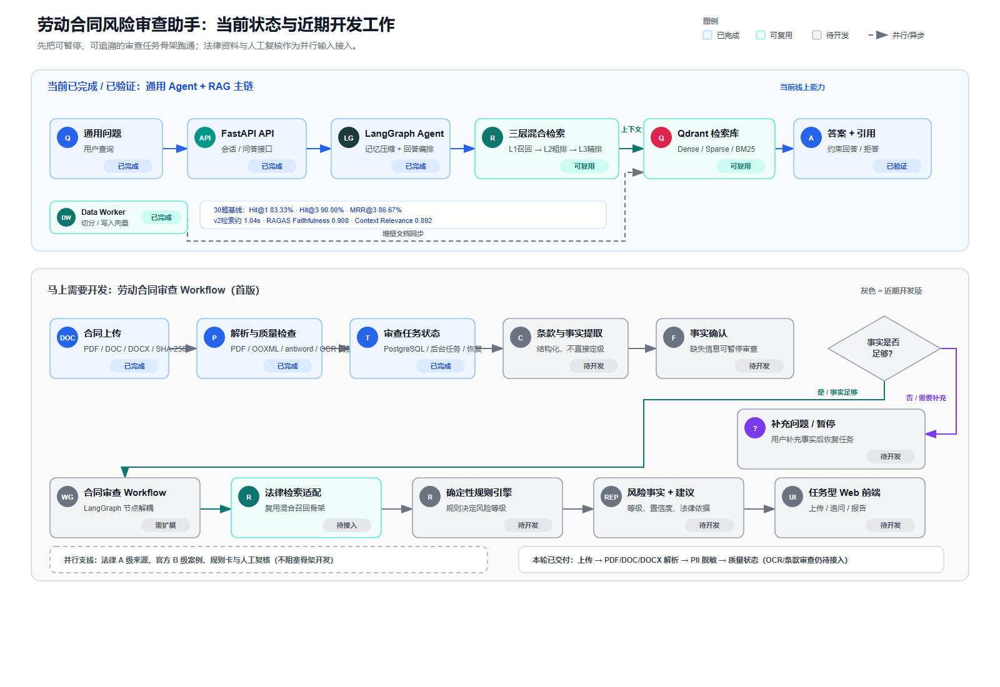
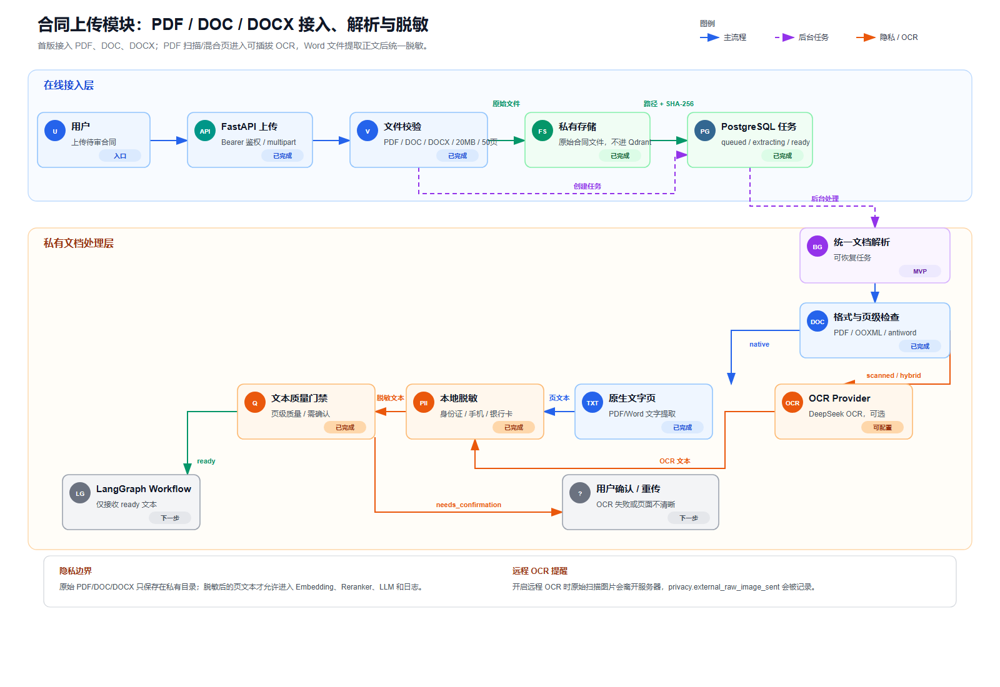
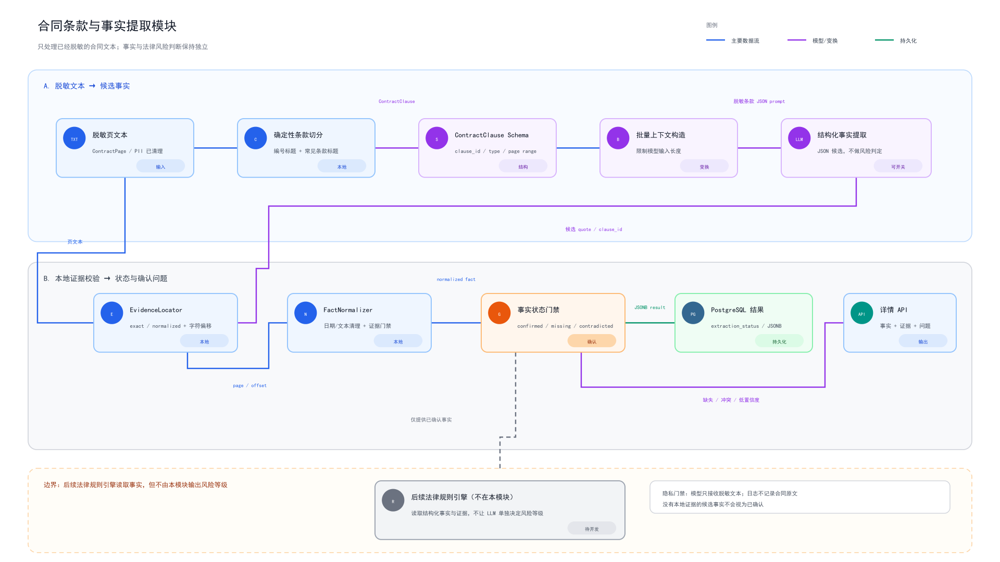
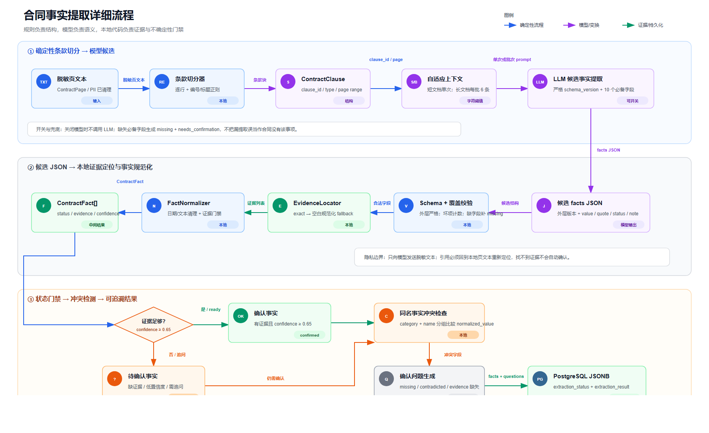
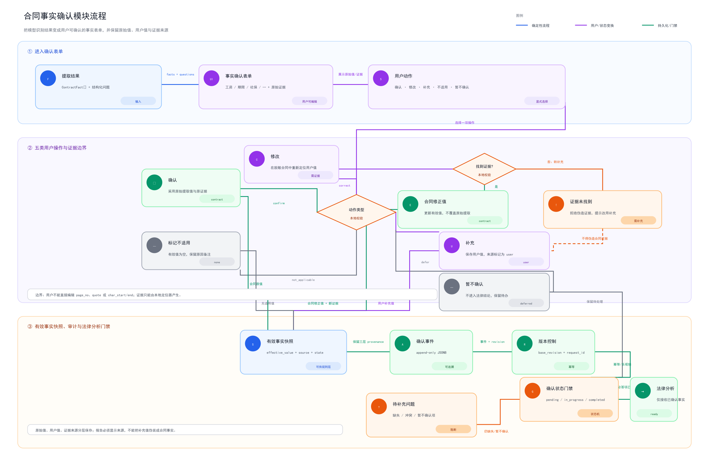
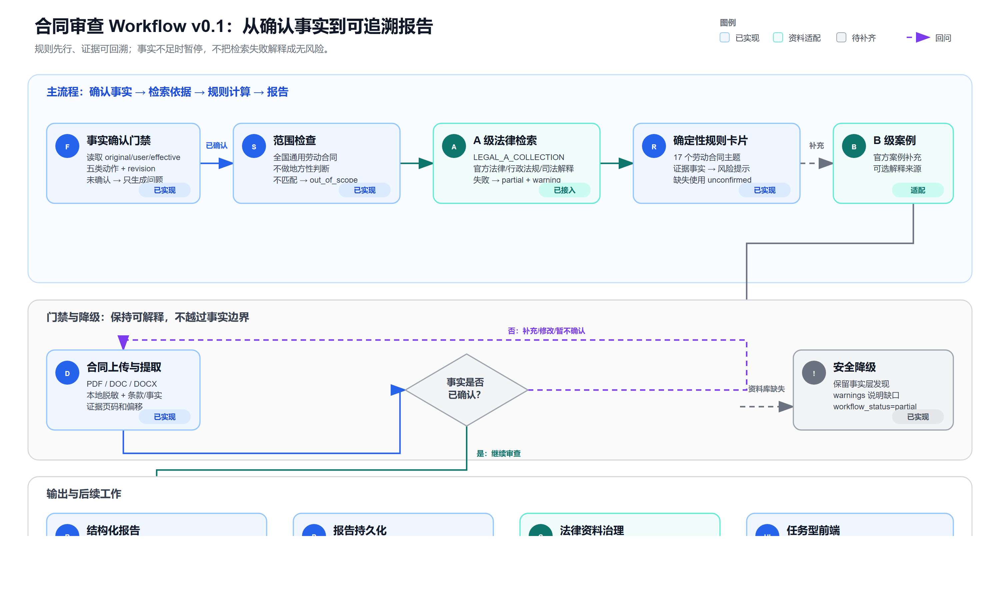
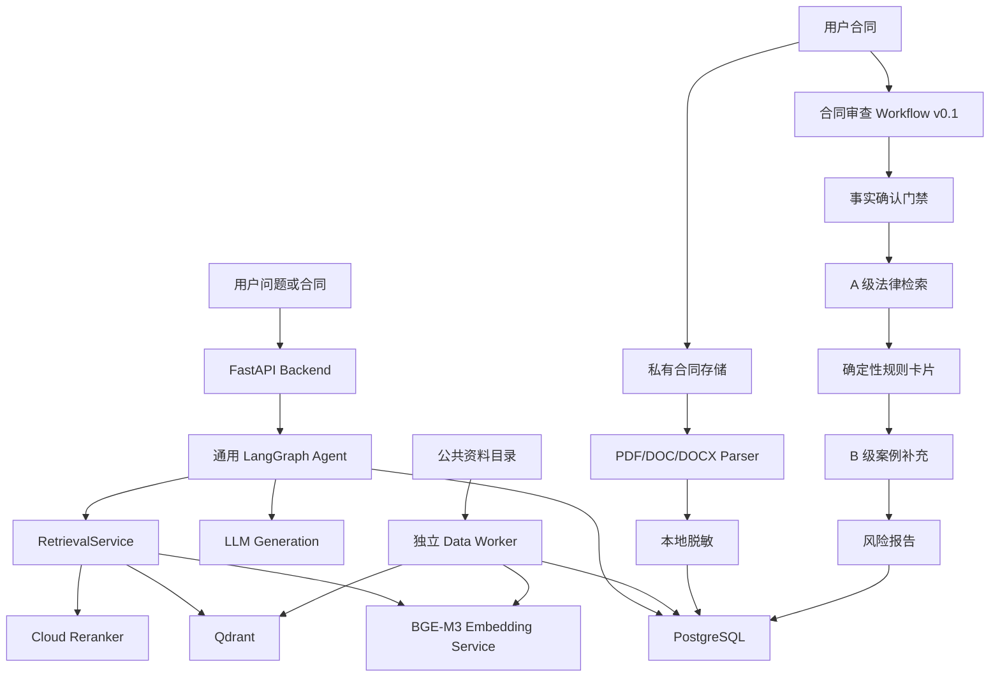

# 劳动合同风险审查助手（Agent + RAG）

这是一个面向中国大陆劳动合同场景的 Agent + RAG 项目。当前仓库已经完成通用 RAG 主链、检索评测闭环、合同文件上传/解析、事实提取/确认，以及可运行的劳动合同审查 Workflow v0.1；法律资料库导入和规则卡片的专家复核仍在进行中。

> 当前产品定位：给用户提供可追溯的风险事实、法律依据、修改建议和待确认问题，**不替用户决定是否签署，也不构成律师意见或结果保证**。



## 项目状态

| 能力 | 状态 | 说明 |
|---|---|---|
| 通用 Agent + RAG 问答 | 已验证 | FastAPI、LangGraph、BGE-M3、Qdrant、PostgreSQL、Data Worker |
| 三层混合检索 | 已验证 | Dense + BGE-M3 Sparse + BM25，经 L1/L2/L3 漏斗输出 Top-3 |
| 检索基线与 RAGAS | 已完成一轮完整基线 | 30 道 watsonxDocsQA 测试题，结果见下文 |
| 合同上传与解析 | 已实现基础模块 | PDF、DOC、DOCX；私有存储、异步任务、质量状态、脱敏 |
| 条款切分与事实提取 | 首版已接入 | 确定性条款切分、结构化事实 Schema、模型候选事实、本地证据定位；默认关闭外部模型调用 |
| 合同审查 Workflow v0.1 | 已实现骨架 | 事实确认门禁、劳动合同范围检查、A 级法律检索、规则卡片、B 级案例补充和结构化报告；资料库未配置时安全降级 |
| 扫描 PDF OCR | 接口已预留 | 默认关闭，需配置 OCR 服务后启用 |
| 劳动法规则卡片与风险分级 | v0.1 已接入 | 规则节点只输出“可能冲突/待确认/观察”，不替代律师作最终法律结论 |
| A 级法律法条切片与入库准备 | 已实现 | 从官方 Word 派生条级 artifact；保留章节、节、条号、原文、哈希和生效时间；只写入独立法律 Collection |
| Web 合同审查前端 | 规划中 | 现有 React 前端暂不作为合同产品验收依据 |

## 已验证的通用 RAG 能力

### watsonxDocsQA 检索门禁

评测 Collection 为 `watsonx_docsqa_colab_v2`，只用于离线评测，不是生产知识库。当前生产通用语料仍由 `RAG_COLLECTION=rag_chunks` 控制。

| 指标 | v1 当前基线 | v2 原生 Sparse/BM25 |
|---|---:|---:|
| Gold Hit@1 | 83.33% | 83.33% |
| Gold Hit@3 | 90.00% | 90.00% |
| MRR@3 | 86.67% | 86.67% |
| Mean Recall@3 | 90.00% | 90.00% |
| 平均检索延迟 | 6.884 秒 | 1.038 秒 |

在相同问题集、相同最终 Top-3 和相同代码路径下，v2 的召回指标没有退化，平均检索速度约提升 **6.63 倍**。`test_3`、`test_5`、`test_8` 是两个 Collection 共同的未命中样本，`test_8` 被保留为后续英文 lexical 召回优化的回归样本。

### 端到端生成与 RAGAS

| 指标 | v2 完整基线 |
|---|---:|
| 生成完成率 | 30 / 30 |
| Gold Hit@1 / Hit@3 | 83.33% / 90.00% |
| 拒答数量 | 3 |
| 平均总延迟 / P95 | 5.938 秒 / 9.513 秒 |
| RAGAS Answer Correctness | 0.653255 |
| RAGAS Faithfulness | 0.908333 |
| RAGAS Context Relevance | 0.891667 |
| RAGAS 覆盖率 | 100% |

这些结果证明的是通用 RAG 链路的可复现性和输出稳定性，不是法律审查的正确率。法律产品上线前仍需要独立的法律专家复核集和规则级验收。

## 合同上传与解析模块

合同上传模块位于 `backend/app/api/contract_reviews.py`、`backend/app/services/contract_review_service.py` 和 `backend/app/infrastructure/` 下。当前模块只负责“安全接收合同并生成脱敏文本”，还不会给出法律风险结论。

### 当前支持

- **PDF**：使用 PyMuPDF 逐页检查文本层；扫描页或文本覆盖率不足时标记为 `needs_confirmation`，可在配置 OCR 后处理。
- **DOCX**：读取 OOXML 正文和表格，保留段落顺序。
- **DOC**：通过 `antiword` 提取旧式 Word 文本；Docker 镜像会安装该运行时。若本机没有可用的 `antiword`，应先转换为 PDF 或 DOCX。
- **隐私处理**：进入后续 LLM、Embedding、Reranker 和日志前，脱敏身份证号、手机号、银行卡号，并清理零宽字符等不可见字符。
- **任务状态**：`queued → extracting → ready / needs_confirmation / failed`。任务和结果写入 PostgreSQL，原始文件保存在私有目录，不进入公共 Qdrant 语料库。
- **质量门禁**：记录页数、文本覆盖率、OCR 使用情况、失败页、可疑页和脱敏统计；不把“解析完成”误认为“合同格式完全还原”。
- **条款与事实提取**：解析完成后可按 `CONTRACT_EXTRACTION_ENABLED=true` 启用。条款先由确定性切分器生成，再由模型提取候选事实；每条事实必须在脱敏页文本中重新定位证据，缺证据、低置信度或相互矛盾的字段会进入 `needs_confirmation`。
- **边界**：事实提取不输出“违法/高风险/建议签署”等法律结论；`extraction_status` 与文件解析 `status` 独立保存，模型失败不会把已经成功解析的合同标记为文件解析失败。



### 条款与事实提取模块

解析通过质量门禁后，系统先用确定性规则切分条款，再按 `contract_extraction` Schema 提取候选事实。每条事实都必须在脱敏页文本中定位证据；缺少证据、置信度不足或同名事实冲突时，进入确认问题，而不是直接生成法律结论。





### 事实确认模块（已实现基础版）

事实提取完成后不会直接进入法律规则判断。确认模块会把每条事实的原始提取值、脱敏合同证据和待确认问题组成表单，用户可以执行五类动作：确认、修改、补充、标记不适用、暂不确认。

- 原始提取值（`original_value`）和原始证据始终保留，不被用户输入覆盖。
- “修改”必须在脱敏合同中重新定位到证据；找不到证据时拒绝伪造合同事实，并提示改用“补充”。
- “补充”单独保存 `user_value`，有效来源标记为 `user`，不能伪装成合同原文。
- 每次提交携带 `base_revision` 和可选 `request_id`，通过 PostgreSQL 乐观锁和追加式事件表防止并发覆盖并支持重试幂等。
- 只有必答事实全部解决并显式提交后，`ready_for_legal_review` 才会为 `true`；确认层不输出违法或是否签署结论。



### 当前限制

扫描 PDF 的 OCR 需要单独配置外部 OCR 服务；DOC/DOCX 无法稳定恢复 Word 原始分页、页眉页脚和浮动文本框，因此相关任务可能进入 `needs_confirmation`。用户合同不会写入 `rag_chunks` 或任何公共评测 Collection。

## 合同审查 Workflow v0.1

首版只做全国通用的中国大陆劳动合同规则，不做地方性判断。产品流程按固定节点编排，先作为 Workflow 实现，再考虑是否开放更自由的 Agent 行为：

```text
上传与隐私确认
  → 文件解析与质量检查
  → 本地脱敏与合同条款结构化
  → 合同范围/事实确认
  → 信息不足时向用户追问
  → A 级法律条文检索
  → 确定性规则计算风险等级
  → B 级官方案例补充解释
  → 证据链校验
  → 输出风险事实、等级、依据、修改建议和待确认事项
```

风险等级由确定性规则和证据状态共同决定；LLM 负责提取、检索、解释和报告表达，不直接替代规则引擎做最终判定。事实不充分时，系统应降低结论置信度并继续追问，而不是编造答案。

当前入口为 `POST /api/contract-reviews/{review_id}/workflow`。它必须先通过事实确认接口的 `ready_for_legal_review=true` 门禁；未确认时只返回待补充问题。A 级法律资料和 B 级案例分别使用 `LEGAL_A_COLLECTION`、`LEGAL_B_COLLECTION`，不会读取 `rag_chunks` 或 `watsonx_docsqa_colab_v2`。资料库未配置或检索失败时报告标记为 `partial`，不会把“没有检索结果”解释成“没有风险”。



## 技术架构



### 主要目录

```text
.
├── backend/                 # FastAPI、LangGraph、检索和合同上传后端
│   ├── app/
│   │   ├── api/             # chat、session、eval、contract-reviews
│   │   ├── agent/           # 通用 Agent 与合同审查 Workflow 图
│   │   ├── infrastructure/  # Qdrant、PostgreSQL、Parser、OCR、私有存储
│   │   ├── schemas/         # API、检索、合同和事实提取数据契约
│   │   └── services/        # 认证、会话、检索、合同解析、提取、确认和规则审查
│   ├── sql/                 # 初始化表和迁移
│   └── tests/               # 后端单元测试
├── data_worker/             # 公共资料增量解析、向量化、写入
├── evaluation/              # 固定问题集、基线、追踪、人工抽查、RAGAS
├── frontend/                # 当前 React/Nginx 前端（合同产品待改造）
├── cli/                     # 本地辅助 CLI
├── docs/                    # 架构、API、迁移、评测和流程图
├── docker-compose.yaml      # 主服务编排
├── docker-compose.dev.yaml  # 后端开发覆盖配置
├── PLAN.md                  # 当前阶段计划和验收门禁
└── AGENTS.md                # 协作与安全边界
```

`data/`、模型文件、数据库持久化目录、`.env`、CodeGraph 索引和真实合同样本均属于本地边界，不提交到 Git。

## 启动与测试

### 启动主服务

```bash
docker-compose -f docker-compose.yaml -f docker-compose.dev.yaml up -d
curl http://127.0.0.1:8000/health
```

修改普通后端源码时优先重启，不要重建 Embedding 镜像：

```bash
docker-compose -f docker-compose.yaml -f docker-compose.dev.yaml restart backend
```

只有修改依赖或 Dockerfile 时才重建 Backend。`embedding_service` 的模型和 Transformers 依赖变化才需要单独重建该服务。

### 启动 Data Worker

```bash
docker-compose -f data_worker/docker-compose.yml up -d --build
```

Backend 和 Data Worker 必须使用同一个生产 `RAG_COLLECTION`。评测 Collection（如 `watsonx_docsqa_colab_v2`）只在评测命令中显式传入，不用于生产写入。

### 准备劳动法律 A 级语料

法律原文不是通用 RAG 的固定长度 Chunk。先在本地从已核验的 Word/Markdown 生成条级 artifact；每条记录保留章节、节、条号、原文偏移、原始文件 SHA-256、官方 URL 与生效日期：

```bash
uv run python -m data_worker.legal_cli prepare \
  --base data/legal/labor_contract \
  --overwrite

uv run python -m data_worker.legal_cli validate \
  --base data/legal/labor_contract
```

输出位于 Git 忽略的 `data/legal/labor_contract/prepared/a_level/`，包含 `articles.jsonl`、`article_chunks.jsonl`、`manifest.json` 与 `validation.json`。当前 artifact 可以上传到服务器并进行隔离 Collection 的导入测试，但 `legal_activation_status=PENDING_LEGAL_REVIEW` 时不能切换 `LEGAL_A_COLLECTION`，也不能作为正式高风险结论的唯一法律依据。

服务器只需重建 **Data Worker** 镜像；不需要重建 Backend 或 Embedding Service。上传 `data/legal/` 后，先执行 dry-run：

```bash
cd data_worker
docker-compose up -d --build
docker exec sentinel python -m data_worker.legal_cli ingest \
  --base /app/data/legal/labor_contract \
  --allow-pending-governance \
  --dry-run
```

实际导入会新建或续传 `legal_labor_a_v1`，并明确拒绝写入 `rag_chunks` 与 watsonxDocsQA Collection。完成法律复核和检索门禁前，不能修改 Backend 的 `LEGAL_A_COLLECTION`。

### 运行测试

```bash
uv run pytest backend/tests evaluation -q
uv run ruff check backend evaluation data_worker
```

先用 `evaluation/rag_smoke.py` 验证主链返回 `answer`、`contexts` 和 `documents`，再运行固定问题集和 RAGAS。RAGAS 依赖留在 `evaluation/requirements.txt`，不装进 Backend 镜像。

## 文档导航

- [当前计划与验收门禁](PLAN.md)
- [文档索引](docs/README.md)
- [合同上传 API](docs/api/backend.md)
- [合同上传模块流程](docs/contract-upload-module.png)
- [条款与事实提取模块流程](docs/contract-extraction-module.png)
- [事实提取详细流程](docs/contract-fact-extraction-flow.png)
- [事实确认模块流程](docs/contract-fact-confirmation-flow.png)
- [合同审查 Workflow v0.1](docs/contract-review-workflow.png)
- [整体开发状态流程图](docs/contract-review-workflow-status.png)
- [劳动合同法律语料计划](docs/labor-contract-legal-corpus-plan.md)
- [自研三层检索算法](docs/self-developed-retrieval-algorithm.md)
- [Qdrant v2 迁移记录](docs/retrieval-v2-migration.md)
- [watsonxDocsQA 完整基线](docs/watsonx-docsqa-full-baseline.md)

## 安全与法律边界

请勿把真实合同、身份证号、手机号、银行卡号、API Key、Cookie 或 `.env` 提交到公开仓库。合同原文只在私有存储中处理，公共 Qdrant 仅用于公共法律/案例资料。任何法律风险结论都应以证据、规则版本和人工复核为前提；本项目当前只提供参考性信息，不承担法律责任或签署决策责任。
