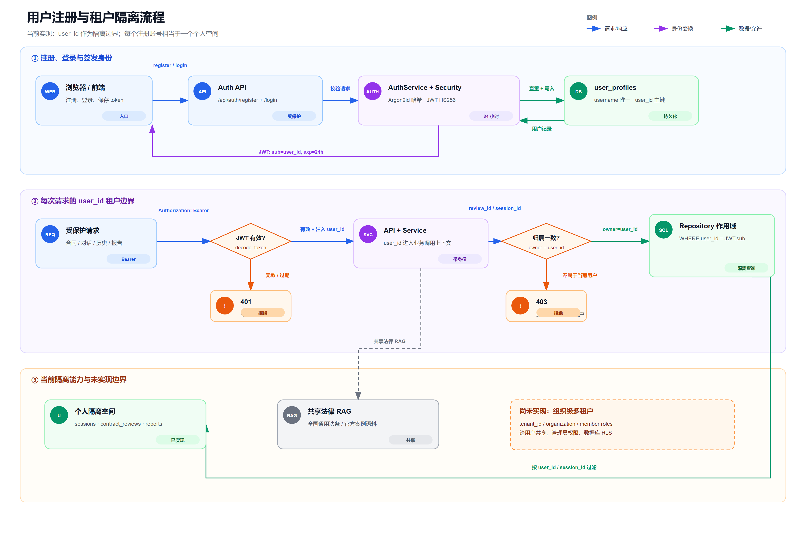

# 项目文档索引

> 更新时间：2026-08-02
>
> 本目录区分当前实现、可执行 Runbook、评测记录和历史经验。文档中的“已完成”必须能在当前源码、Compose 配置或评测 `summary.json` 中找到证据。
>
> 流程图的 PNG 预览按 SVG 原始画布尺寸以 2x 分辨率导出，避免底部裁剪；需要检查细节时，请打开同目录中同名的 `.svg` 源图。

## 推荐阅读顺序

| 文档 | 用途 | 状态 |
|---|---|---|
| [`../README.md`](../README.md) | 项目定位、当前能力、启动方式和安全边界 | 当前总览 |
| [`../PLAN.md`](../PLAN.md) | 开发阶段、完成项、下一步和验收门禁 | 当前计划 |
| [`contract-review-workflow-status.png`](contract-review-workflow-status.png) | 已完成能力、统一会话与待治理工作的总览图 | 当前状态 |
| [`contract-review-workflow.png`](contract-review-workflow.png) | v0.1 事实确认、法律检索、规则卡片、报告持久化和回问节点 | Workflow 详细流程 |
| [`contract-upload-module.png`](contract-upload-module.png) | PDF/DOC/DOCX 上传、解析、脱敏、质量门禁和会话承接 | 已实现基础模块 |
| [`contract-extraction-module.png`](contract-extraction-module.png) | 条款切分、结构化事实提取、证据定位、结果持久化和 Workflow 边界 | 已实现基础模块 |
| [`contract-fact-extraction-flow.png`](contract-fact-extraction-flow.png) | 事实提取内部步骤、状态门禁、冲突检测和结果持久化 | 详细流程 |
| [`contract-fact-confirmation-flow.png`](contract-fact-confirmation-flow.png) | 五类用户动作、证据复核、有效事实快照、revision 和审计门禁 | 已实现基础模块 |
| [`user-registration-tenant-isolation.png`](user-registration-tenant-isolation.png) | 用户注册、JWT 身份解析、user_id 作用域与当前租户能力边界 | 当前认证与隔离 |
| [`chat-route-data-flow.png`](chat-route-data-flow.png) | 统一 session 中的文字提问、合同上传/审查和合同追问数据流 | 当前对话数据流 |
| [`storage-boundary.md`](storage-boundary.md) | JSON/JSONL 离线工件、PostgreSQL 生产数据、私有合同文件与 Qdrant 的存储边界 | 当前实现 |
| [`storage-boundary.png`](storage-boundary.png) | 上述存储边界的可视化总图 | 当前存储架构 |
| [`api/backend.md`](api/backend.md) | Backend、RAG 和合同上传 API | 当前 API |
| [`self-developed-retrieval-algorithm.md`](self-developed-retrieval-algorithm.md) | L1/L2/L3 Cascade Funnel 的设计和边界 | 当前 v2 |
| [`retrieval-v2-migration.md`](retrieval-v2-migration.md) | Qdrant 升级、离线迁移、门禁和回滚 | 已执行，可复用 |
| [`watsonx-docsqa-full-baseline.md`](watsonx-docsqa-full-baseline.md) | 30 题检索、生成、人工抽查和 RAGAS 结果 | v2 完整基线 |
| [`labor-contract-legal-corpus-plan.md`](labor-contract-legal-corpus-plan.md) | 劳动合同法律知识库的资料分层、来源核验、法条切片、隔离入库和激活门禁 | 当前采集计划 |
| [`contract-server-acceptance.md`](contract-server-acceptance.md) | 005/006/007 迁移检查、PDF/DOC/DOCX API 回归、隐私门禁和删除验证 | 服务端验收 Runbook |
| [`pitfall-guide.md`](pitfall-guide.md) | Docker、依赖、评测和历史迁移中的常见问题 | 历史经验 |

## API 与基础设施

- [`api/backend.md`](api/backend.md)：FastAPI、LangGraph、合同上传和状态查询。
- [`api/embedding-service.md`](api/embedding-service.md)：BGE-M3 Dense/Sparse HTTP 接口。
- [`api/db-qdrant.md`](api/db-qdrant.md)：生产/评测 Collection、原生 Sparse 和快照。
- [`api/db-pg.md`](api/db-pg.md)：PostgreSQL、Checkpoint、指纹和合同任务表。
- [`api/frontend.md`](api/frontend.md)：当前 React/Nginx 前端的冻结边界。

## 合同审查资料

当前已落地的是合同上传、文件格式解析、私有存储、页级质量判断、隐私脱敏、条款切分、结构化事实提取、证据定位、事实确认和 Workflow v0.1 基础编排。报告已经持久化到 PostgreSQL，并通过统一 `session_id` 接入报告问答和前端恢复。A 级法律资料已经支持从本地官方 Word 生成可复现的法条级 artifact，并已导入独立的 `legal_labor_a_v1` Collection；`LegalRetrievalService` 的 A 级引用过滤已经接入，正式法律激活、专家复核和 B 级案例治理仍待完成。

法律资料的具体收集范围、官方来源、版本核验、法条切片、数据目录和入库前清单见 [`labor-contract-legal-corpus-plan.md`](labor-contract-legal-corpus-plan.md)。真实法律原文、案例、prepared artifact 和合同测试样本放在被 Git 忽略的 `data/legal/labor_contract/`，不提交到公开仓库。

上图只描述当前已实现的“脱敏文本 → 条款切分 → Schema 候选事实 → 本地证据定位 → 缺失/冲突确认”数据流；它不代表已经接入法律条文检索或风险判定。

当前认证模型是“每个账号一个个人空间”：`user_id` 来自 JWT，并贯穿合同、报告和会话访问检查；法律 RAG 语料是共享知识库。组织级 `tenant_id`、成员角色、跨用户共享和数据库 RLS 尚未实现，不能把当前能力描述成完整的企业 SaaS 多租户。

存储边界的判定原则是：JSON/JSONL 主要用于法律语料和评测等离线工件；合同元数据、脱敏正文、结构化事实、确认事件、报告和会话索引进入 PostgreSQL；原始合同保留在用户隔离的私有文件目录；Qdrant 只保存已治理的共享法律检索语料，不写入用户合同。

这张图按当前代码区分三类入口，但它们最终共享同一个 `session_id`：合同上传完成解析、事实确认和审查 Workflow 后，会从 PostgreSQL 读取脱敏正文、结构化事实和风险报告，组装为该会话的 `contract_context`；它不是一个额外的 JSON 文件。用户可以先文字提问，再上传合同后继续追问，也可以直接从合同页面进入问答。合同问答需要法律依据时才调用治理后的法律 RAG，不把私有合同写入共享知识库。没有合同绑定时，直接聊天仍只使用普通/法律知识库检索。

事实确认模块使用 `GET/PUT /api/contract-reviews/{review_id}/confirmation`。它把 `original_value`、`user_value`、`effective_value` 和 `evidence` 分层保存；用户无法直接编辑页码、引用或字符偏移。`correct` 必须通过本地 `EvidenceLocator` 找到脱敏合同证据，`supplement` 则明确标记为用户来源。

详细图进一步展开：条款标题由确定性规则识别，模型只返回候选 JSON；候选事实经过 Schema 校验、本地 exact/空白规范化匹配、证据与置信度门禁、同名事实冲突检查后，才写入 `extraction_result`。

合同原文不进入公共 `rag_chunks` 或 `watsonx_docsqa_colab_v2`；扫描件 OCR 默认关闭，外部 OCR 原图发送必须通过显式配置并写入隐私审计字段。

## 评测资料

评测脚本位于 `../evaluation/`，通过真实 Backend/RetrievalService 运行，不安装进生产 Backend 镜像。最新 v2 关键结果：

- Retrieval：Hit@1 `83.33%`、Hit@3 `90.00%`、MRR@3 `86.67%`、平均检索 `1.038s`。
- Generation：30/30 完成，平均总延迟 `5.938s`，P95 `9.513s`。
- RAGAS 0.4.3：Answer Correctness `0.653255`、Faithfulness `0.908333`、Context Relevance `0.891667`，覆盖率 100%。

完整运行签名、零命中样本和指标解释见 [`watsonx-docsqa-full-baseline.md`](watsonx-docsqa-full-baseline.md)。

## 事实来源优先级

文档与运行状态冲突时，按以下顺序核对：

1. 当前源码和 `docker-compose.yaml` / `docker-compose.dev.yaml`；
2. 评测结果目录中的 `summary.json`、Manifest 和运行签名；
3. 根目录 `README.md`、`PLAN.md` 和本目录当前文档；
4. `pitfall-guide.md` 等历史记录。

`data/`、`.env`、模型权重、数据库持久化目录、真实合同样本和 `.codegraph/` 均属于本地边界，不应提交到 GitHub。
