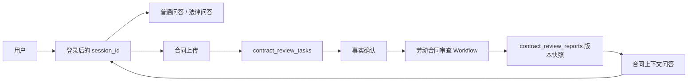

# 合同会话、报告与发布治理

本文记录合同审查产品从“上传一份合同”扩展到“可持续对话、可恢复报告和可审计发布”的第一批实现。

## 已实现的开发任务

### 1. 统一会话

- 合同上传支持 `session_id`；未提供时，Backend 自动创建一个新的 UUID 会话。
- `contract_review_tasks.session_id` 把合同任务绑定到会话。
- 普通问答、法律问答和合同上下文问答都复用同一个 LangGraph `thread_id=session_id`。
- 合同问答读取当前会话绑定的脱敏合同正文、提取/确认事实 JSON 和风险报告 JSON；不会把原始文件或未脱敏内容注入会话。
- 会话历史现在要求 Bearer Token，并按 PostgreSQL `sessions.user_id` 做归属校验。



### 2. 报告持久化与下载

- `POST /api/contract-reviews/{review_id}/workflow` 在 Workflow 完成后保存不可变报告版本。
- `GET /api/contract-reviews/{review_id}/report` 查询最新报告，不会重复运行 Workflow。
- `GET /api/contract-reviews/{review_id}/report.pdf` 由已脱敏的结构化报告生成 PDF，响应带 `private, no-store`。
- `DELETE /api/contract-reviews/{review_id}` 删除合同任务、页文本、事实确认、报告和私有原文件。
- 报告保存 `report_sha256`、输入文件 SHA-256、版本号和会话 ID，便于审计与回溯。

### 3. 留存与隐私

- 默认 `retention_policy=short`，留存 7 天；用户显式选择 `long_opt_in` 时留存 30 天。
- `expires_at` 到期后由 Backend 周期任务清理（默认每 300 秒），启动时也会先执行一次补偿清理。
- `006-contract-retention.sql` 会把迁移前的存量任务按默认 7 天策略从 `created_at` 回填 `expires_at`，不会把 NULL 当作永久留存。
- 原始合同只放在私有文件目录；公共 API 只返回脱敏页文本和结构化报告。
- `AUTH_SECRET_KEY` 必须在服务器 `.env` 中设置为至少 32 个字符的随机值；未配置时 Backend 拒绝启动，Compose 不再提供默认密钥。
- `evaluation/contract_security_smoke.py` 检查身份证、手机号、银行卡脱敏和公开 Schema 不暴露原始存储字段。

## 法律问答与合同上下文问答的边界

| 模式 | 允许的知识来源 | 是否绑定合同上下文 |
|---|---|---|
| `general` | 通用 `RAG_COLLECTION` | 否 |
| `legal` | `LEGAL_A_COLLECTION`（后续可增加 B 级工具） | 否 |
| `contract_review` | 脱敏合同正文、提取/确认事实、风险报告；需要法律依据时调用 `LEGAL_A_COLLECTION` | 是，必须同一 `session_id` |

法律资料仍必须通过 `LegalRetrievalService` 的来源等级、可引用性和治理状态检查。合同原文不会写入公共 RAG Collection。

工具边界由服务端 `ModeAwareToolNode` 强制执行，而不只依赖 Prompt：`general` 只能调用通用检索，`legal` 只能调用法律资料检索，`contract_review` 只能调用法律资料检索，不能让通用 RAG 混入私有合同。合同问答缺少 `review_id`、合同不存在或会话不一致时会直接拒绝。

合同上传不是一条新的对话线程，而是对当前 `session_id` 的上下文写入：用户可以先进行普通文字问答，再上传合同；合同解析完成后，下一条问题会在同一段历史中同时看到此前文字和合同上下文。删除合同时不删除整条 session 历史，下一次没有 `review_id` 的请求会显式清空 `contract_context`。

文件二进制本身仍由合同上传/解析的异步流水线处理，不直接塞进 LangGraph 消息；解析完成后，`ChatService` 按 `review_id` 读取用户有权访问的脱敏页文本、事实 JSON 和报告 JSON，再写入同一 session 的 `contract_context`。因此统一的是对话上下文和追问入口，而不是把文件解析任务与文字节点强行合并。

为避免敏感事实进入跨模式长期记忆，合同上下文 session 会清空进入合同模式前的旧 `summary`；后续摘要只压缩非合同消息，普通/法律模式过滤合同轮次，原始对话仍按用户需要保留在同一 session 中。
同一 session 可以先后绑定多份合同；进入合同 B 时，模型输入只保留 `contract:B` 的合同消息和非合同消息，不会混入合同 A 的历史回答。

升级兼容：`sessions.conversation_scope_version` 记录一次性迁移结果。由于任务删除/过期后
无法从数据库准确还原“历史上是否绑定过合同”，迁移前所有尚未有 scope 版本的旧 session
都会保守地检查一次 checkpoint。若历史消息没有 `conversation_scope`，系统会设置
`legacy_unscoped_messages` 标记：这类无标签消息仍可由历史接口展示，但不会再送入模型；因此
旧普通会话可能丢失模型侧连续记忆，但不会泄漏已删除合同。新 session 不受影响，从本版本开始
写入的消息均带 `general`、`legal` 或 `contract:<review_id>` 范围标签。

## 专家评测集与发布门禁

### 生成法律题集草稿

脚本直接读取本地 `articles.jsonl`，不调用 RAG，也不把资料上传到外部模型：

```bash
uv run python evaluation/build_labor_legal_eval_set.py \
  --articles data/legal/labor_contract/prepared/a_level/articles.jsonl \
  --output evaluation/datasets/labor_legal_expert_draft.jsonl \
  --limit 15
```

输出包含单法条题和跨法条题，但全部标记为 `DRAFT_NEEDS_EXPERT_REVIEW`。法律专家确认后，把 `review_status` 改为 `APPROVED`，才可进入正式评测。

### 安全 Smoke 与发布门禁

```bash
uv run \
  --with-requirements evaluation/requirements.txt \
  --with-requirements backend/requirements.txt \
  python evaluation/contract_security_smoke.py \
  --output data/contract_security_smoke.json

uv run python evaluation/contract_release_gate.py \
  --legal-smoke data/legal/legal_retrieval_smoke_v1.json \
  --expert-set evaluation/datasets/labor_legal_expert.jsonl \
  --security-smoke data/contract_security_smoke.json \
  --minimum-expert-questions 15
```

门禁同时要求：法律检索 Smoke 全部通过、专家题集达到数量且全部审批、安全 Smoke 通过。未审批的草稿题集会明确返回 `blocked`。

## 数据库迁移

已有数据库按顺序执行：

```bash
docker exec -i db_pg psql -U admin -d ai_assistant \
  < backend/sql/migrations/005-session-contract-report.sql
docker exec -i db_pg psql -U admin -d ai_assistant \
  < backend/sql/migrations/006-contract-retention.sql
docker exec -i db_pg psql -U admin -d ai_assistant \
  < backend/sql/migrations/007-session-conversation-scope.sql
```

全新数据库会由 `backend/sql/init/03-contract-review.sql` 一次性创建同等结构。迁移完成后再重启 Backend；不需要重建 embedding 镜像。

## 尚未完成的后续任务

1. 邀请制访客 Token：只允许查看指定报告，默认禁止上传、改事实和访问其他会话。
2. 审查历史列表页：在侧边栏展示当前用户的合同任务、报告版本和到期时间。
3. 周期性留存清理：把启动时清理升级为定时 Worker，并增加删除审计事件。
4. B 级案例库接入合同上下文问答和专家题集中的跨法条/跨案例题。
5. 法律专家复核规则卡片，建立正式 `APPROVED` 题集后再打开发布门禁。

## 代码审查复核

2026-08-01 的代码审查已关闭默认 JWT 密钥、会话 UUID 绕过、报告绑定、工具源隔离、周期留存、存量回填、报告并发版本、前端会话恢复和多工具调用协议等问题。到期清理采用“先删除私有原件、成功后 finalize 数据库记录”的两阶段流程，文件删除失败时保留记录并在下一周期重试。
