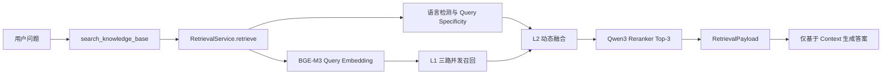
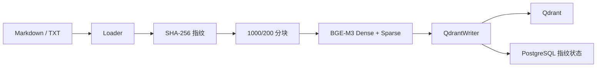

# 自研 Cascade Funnel 召回算法详解

> 文档状态：2026-07-20，与 Retrieval v2 当前源码同步
> 生产入口：`RetrievalService.retrieve()` → `get_final_funnel_top3()`
> 主要实现：`backend/app/components/retriever/qdrant/v2_0_0/main.py`
> 评测状态：v1 完整基线已冻结；v2 迁移和 3 题 Smoke 已完成，30 题门禁待归档

## 1. 一句话概括

这不是一次单独的向量搜索，而是一套逐层收缩的三层漏斗：

1. L1 同时使用 Dense、BGE-M3 Sparse 和 BM25 扩大候选覆盖；
2. L2 根据 Query 的语言特征动态融合语义分数和字面分数，并保护强 Dense 候选；
3. L3 仅对粗排 Top-10 调用外部 Cross-Encoder Reranker，最终返回 Top-3；
4. Reranker 异常时退回粗排 Top-3，保证 Agent 不因外部精排失败而整体不可用。

核心思想是：**多路互补保证“找得到”，动态融合和精排解决“排得准”，降级策略保证“还能用”。**

## 2. 当前真实调用链



| 层 | 主要职责 | 是否改变排序 |
|---|---|---|
| Agent Tool | 将自然语言查询交给 Retrieval Service | 否 |
| Retrieval Service | Query Embedding、Collection 注入、调用 Funnel | 否 |
| Cascade Funnel | 召回、融合、粗排、精排 | 是 |
| Retrieval Schema | 生成稳定 DTO、引用上下文和评测字段 | 否 |

Agent、Eval API 和离线评测都复用 `RetrievalService`，因此评测不是另写一套“更好看”的
召回路径。Collection 由构造参数或 `RAG_COLLECTION` 注入，隔离数据集不再需要修改模块常量。

## 3. 文档如何进入检索库



Data Worker 的幂等规则：

1. 内容和路径均未变化时跳过；
2. 内容相同但路径变化时，只同步 `source`；
3. 新内容才重新切块和 Embedding；
4. Point ID 根据 Chunk 稳定生成，重复 Upsert 不会产生随机副本；
5. 成功写入 Qdrant 后才更新 PostgreSQL 指纹状态。

默认分块参数：

| 参数 | 值 |
|---|---:|
| Chunk size | 1000 字符 |
| Chunk overlap | 200 字符 |
| 分隔优先级 | 段落 → 换行 → 中文句号/分号 → 空格 → 字符 |

BGE-M3 一次返回 1024 维 Dense 和 `token_id → weight` Sparse 表示，不使用 ColBERT
multi-vector。Dense 主要覆盖同义表达，Sparse 主要保留具体词项和型号等字面信号。

## 4. v1 与 v2 Collection 的区别

### 4.1 v1：兼容回退结构

旧 `rag_chunks` 和 `watsonx_docsqa_colab_v1` 使用：

```text
unnamed Dense vector
payload.sparse_indices[]
payload.sparse_values[]
```

旧 Sparse 查询需要 Scroll 全部 Point，再在 Backend 中计算内积。代码仍保留该路径，
目的是让生产旧库在正式切换前继续可用；日志会明确输出 `Payload扫描回退`。

### 4.2 v2：当前目标结构

```text
Named vectors
├── dense             BGE-M3 Dense 1024-dim
├── bge_m3_sparse     Qdrant Native Sparse Index
├── bm25_word         英文 BM25 Sparse Vector
└── bm25_zh           中文 BM25 Sparse Vector

Payload
├── doc_id / chunk_id / chunk_text / title / source / sha256 / user_id
├── retrieval_schema_version = 2
├── fulltext_en
├── fulltext_zh
└── fulltext_zh_segmented
```

`watsonx_docsqa_colab_v2` 已从 v1 离线迁移 6759 个 Point：

- Qdrant Server 1.10.1，`qdrant-client` 1.10.1；
- 原生 Sparse 和动态 IDF 可用；
- `multilingual` Full-text Index 创建成功；
- 目标 Payload 不再复制旧 `sparse_indices/sparse_values`；
- 来源 Collection 保持不变，可随时回滚。

Qdrant Payload Full-text Index负责匹配和过滤，本身不提供 BM25 排序分数。真正参与
L1 排序的是 `bm25_word` / `bm25_zh` Named Sparse Vector，不能把两者混为一谈。

## 5. L1：三路并发召回

```text
Dense Top-10 ───────────┐
BGE Native Sparse Top-10 ├─→ Point ID 去重 → L1 候选池
BM25 Top-10 ─────────────┘
```

三路通过 `asyncio.gather()` 并发执行，每条同步 Qdrant 调用进入独立线程。

### 5.1 Dense

- 使用 Cosine 相似度；
- v2 查询命名向量 `dense`；
- v1 回退查询 unnamed Dense；
- 适合问题与证据用词不同、但语义接近的场景。

### 5.2 BGE-M3 Sparse

Query 与文档 Sparse 权重做点积。v2 直接查询 `bge_m3_sparse` 的原生倒排索引，
不再 Scroll 全库。只有检测不到该命名向量时才进入 v1 Payload 回退。

这次改造解决了旧实现最明显的规模问题：旧 Sparse 延迟随 Collection Point 数量近似
线性增长，而原生 Sparse 由 Qdrant 索引完成候选查找。

### 5.3 BM25

英文使用 word 风格 Token，中文使用 Jieba Token；不额外做词干化和停用词删除。

文档 TF 权重：

```math
TF(t,d)=\frac{f(t,d)(k_1+1)}{f(t,d)+k_1(1-b+b\cdot |d|/avgdl)}
```

当前参数：

```text
k1 = 1.2
b = 0.75
avgdl = 256
```

Token 使用稳定的 BLAKE2s u32 ID；迁移器会检查哈希碰撞，有碰撞时拒绝静默建库。
IDF 由 Qdrant `modifier=idf` 根据 Collection 动态计算。

### 5.4 去重

按 Dense → Sparse → BM25 的连接顺序遍历，使用 Qdrant Point ID 去重。这里保留的是
Point 对象，真正的最终排序仍由 L2 和 L3 决定。

## 6. 双语 Query Specificity

`S` 表示字面检索权重，`1-S` 表示 Dense 语义权重：

```math
S=clip(0.8-0.6\times signal\_density, 0.2, 0.8)
```

### 英文

- 使用 word 分词，不做词形还原；
- 信号是冠词、代词、系/助/情态动词、介词、连词和疑问词；
- 排除 `not/no/nor/very/too/extremely` 等仍携带判断语义的词；
- 密度 = 功能词命中次数 / 总 Token 数。

### 中文

- 使用 Jieba POS；
- 只统计 `r/u/p/c/y` 类句法或社交功能词；
- 名词和动词不计入，避免把“申请、办理、规定”等检索关键词误伤；
- 再用“请问、我想、能不能”等固定短语补偿 POS 漏判。

### 兜底

- 置信度低于 0.7或文本不超过3字符：`S=0.5`；
- `zh/zh-cn/zh-tw` 统一为中文；
- 其他语言统一走英文逻辑；
- S 始终限制在 `[0.2, 0.8]`。

实测示例：

| Query | S | 解释 |
|---|---:|---|
| `learning rate scheduler` | 0.80 | 关键词式，偏字面 |
| `What is the learning rate?` | 0.44 | 自然问句，提高语义权重 |
| `中期考核细则` | 0.80 | 专业短语，偏字面 |
| `关于中期考核的办理流程` | 0.60 | 轻度自然语言化 |
| `那这个规定到底怎么说` | 0.50 | 强口语表达 |

## 7. L2：动态融合与 Dense 保底

三路原始分数尺度不同，因此每路独立 Min-Max：

```math
n_p(d)=\frac{s_p(d)-min(s_p)}{max(s_p)-min(s_p)+10^{-6}}
```

未被某一路召回的候选，该路分数为 0。基础融合公式：

```math
base(d)=(1-S)n_{dense}(d)+S(0.5n_{sparse}(d)+0.5n_{bm25}(d))
```

强语义候选保护：

```math
final(d)=max(base(d),0.5),\quad n_{dense}(d)>0.85
```

然后按 `final(d)` 排序并截断 Top-10。这个保底只保护本轮 Dense 排名非常高的候选，
不是无条件给所有 Dense 结果加分。

## 8. L3：外部 Reranker

当前基线使用 `Qwen/Qwen3-Reranker-8B`。它同时读取 Query 与单个候选文本，精度通常
高于双塔相似度，但成本更高，所以只处理 L2 Top-10。

Reranker 返回 `index + relevance_score`，系统排序后取 Top-3。以下异常会退回 L2 Top-3：

- 超时、鉴权或非 2xx；
- 响应格式错误；
- `results` 为空；
- 其他网络或运行异常。

## 9. 输出契约

```text
RetrievalPayload
├── context       带 [1]/[2]/[3] 和来源的 Prompt 文本
├── contexts[]    生成模型实际使用的文本
└── documents[]
    ├── point_id / doc_id / chunk_id
    ├── title / source
    ├── text / context_text
    ├── rank
    └── qdrant_score
```

最终 Rank 的事实来源是 Funnel 返回顺序。`qdrant_score` 不是 L2 融合分数，也不是
L3 relevance score，因此不能用它单独解释最终排名。评测必须同时保留 contexts、
documents、Gold IDs 和运行签名。

## 10. Prompt 与检索的边界

检索负责提供 Top-3 证据，Prompt 负责约束答案：

- 身份是通用知识库助手，而不是特定学校助手；
- 使用与问题相同的语言回答；
- 只能使用 Context 中的事实；
- 只要存在可回答证据就不能拒答；
- 只有部分证据时给出部分答案并说明边界；
- 每个事实性句子必须带引用；
- 全部 Context 均无效时才允许拒答。

检索命中并不保证答案一定正确，所以 Hit@K 与 RAGAS 必须分阶段评估。

## 11. 基线与当前进展

### v1 固定 30 题检索

| 指标 | 结果 |
|---|---:|
| Hit@1 | 83.33% |
| Hit@3 | 93.33% |
| MRR@3 | 88.33% |
| Mean Recall@3 | 93.33% |
| Mean / P50 / P95 | 4.376 / 3.821 / 9.270 秒 |
| 错误题数 | 0 |

严格 Gold 未命中：`test_3`、`test_5`。人工诊断显示 `test_3` 是真实证据遗漏，
`test_5` 更接近单一 Gold ID 造成的假阴性，因此严格指标与人工 Answer-Support 应并存。

### v1 生成与 RAGAS

| 指标 | 结果 |
|---|---:|
| 生成完成 | 30/30 |
| Gold Hit@1 / Hit@3 | 80.00% / 93.33% |
| Answer Correctness | 0.613954 |
| Faithfulness | 0.794416 |
| Context Relevance | 0.900000 |
| 覆盖率 | 100% |

人工抽查发现：6 道拒答均为错误拒答；Faithfulness 最低样本以幻觉为主；
Answer Correctness 低分同时包含生成问题和 Ground Truth 冲突。这些发现推动了通用 Prompt 改造。

### v2 当前状态

- 6759/6759 Point 迁移完成，耗时 25.829 秒；
- 3 题 Smoke 3/3 完成，零错误；
- Hit@1/Hit@3 均为 66.67%，未命中仍是已知 `test_3`；
- P50 为 0.964 秒，但三题样本不足以评价 Mean/P95；
- 完整 30 题比较是正式门禁，完成前不宣称 v2 优于 v1。

## 12. 当前已知边界

1. 每路固定 Top-10 是硬召回上限，L1 没找到的证据无法由 L2/L3 补回。
2. 表格型 Gold 文档可能在字符切块后丢失结构优势。
3. `avgdl=256` 是工程固定值，不是每次增量写入时重新计算的全库平均长度。
4. Token u32 哈希碰撞概率低但非零；离线迁移会检测，增量写入仍应监控。
5. L2/L3 分数和 Reranker 降级状态尚未进入最终 DTO。
6. `langdetect` 对极短或中英文混合 Query 不稳定，因此必须保留中性兜底。
7. 外部 Reranker 延迟和网络波动仍可能主导 P95。
8. 旧同步 RRF `run()` 仍在源码中，但不是生产路径，后续可在独立清理任务中处理。

## 13. 哪些应保留，哪些必须 A/B

长期保留：

- 多路互补与三层漏斗；
- Query Embedding 与业务服务解耦；
- 分路归一化和 Dense 语义保底思想；
- Reranker 异常降级；
- 稳定 Point/Chunk/Document ID；
- 结构化 RetrievalPayload；
- 固定问题集、逐题结果和可恢复评测。

只能通过 A/B 调整：

- 每路 Top-K；
- S 的映射、上下界与词表；
- Dense/Sparse/BM25 内部权重；
- Dense 0.85 阈值与 0.5 保底；
- L2 Top-10、L3 Top-3；
- Chunk size/overlap、Reranker 模型和 Context 截断长度。

任何调整都至少比较 Hit@1、Hit@3、MRR@3、逐题退化、Mean/P95、错误拒答、
Faithfulness 和覆盖率，不能根据单道题直接改参数。

## 14. 源码索引

| 主题 | 文件 |
|---|---|
| 三层 Funnel | `backend/app/components/retriever/qdrant/v2_0_0/main.py` |
| Query Specificity / BM25 | `backend/app/services/query_specificity.py` |
| Retrieval Service | `backend/app/services/retrieval_service.py` |
| Retrieval DTO | `backend/app/schemas/retrieval.py` |
| Agent Tool / Prompt | `backend/app/agent/tools.py`、`prompts.py` |
| BGE-M3 HTTP Service | `backend/embedding_service/app.py` |
| Data Worker Writer | `data_worker/ingest/writer.py`、`lexical.py` |
| v2 离线迁移 | `evaluation/qdrant_v2_collection_migrate.py` |
| 固定检索基线 | `evaluation/watsonx_docsqa_retrieval_baseline.py` |
| v1/v2 门禁比较 | `evaluation/compare_retrieval_baselines.py` |
| 生成与 RAGAS | `evaluation/watsonx_docsqa_generation_baseline.py`、`watsonx_docsqa_ragas.py` |

## 15. 总结

当前设计已经从早期的“Dense + Payload Sparse + 轻量 Fulltext”演进为：

```text
BGE-M3 Query 双表示
  → Native Dense / Native Sparse / BM25 多路召回
  → 双语 Query-aware 动态融合
  → Dense 强语义保底
  → Qwen3 Reranker Top-3
  → 通用知识库 Prompt 与稳定评测契约
```

下一步不是继续增加新算法，而是完成 v2 的 30 题门禁，并用逐题结果确认：性能改善是否
可重复、Hit@3 是否不退化、错误拒答和幻觉是否真正下降。只有这些证据成立，才应迁移生产库。
